# Nalati — named elites and bosses

*Design section for [`project/archive/2026-09-23-nalati.md`](../../plans/NALATI.md), 2026-09-22. Mockups are in
`art/nalati-grasslands/round-2/4-named-elites/` and `art/nalati-grasslands/round-2/5-bosses/`, plus round 3 in
`art/nalati-grasslands/round-3/1-elite-swap/` and `art/nalati-grasslands/round-3/2-storm-titan/`, all in art style B (painterly).*

**The user's decisions (2026-09-22, after round 2):**
- Elites: keep **Aqbars, Kokbori, Qyran and Qara Batyr**. **Tas Ata, the Stone Father, is dropped**, and the balbal circle
  keeps its ordinary balbal warriors. His replacement is **either the feral black stallion or the steppe bear**. Both are
  designed below (E4a and E4b), with one mockup each, so the user can pick.
- Bosses: **both the Golden King and Jel Ata, the Storm Titan**. The Storm Titan is Nalati's second boss, fought on horseback
  on the Sky Grassland during a storm (section 2). So the rule "one boss per shard" becomes **"one or two bosses per shard"**.

The user asked for three things. First, the leopard becomes a **named elite**. Second, named elites become a **whole
system** of special minibosses. Third, the Kurgan King becomes a **full boss**, and bosses become an engine notion of their own.
Ghost riders stay in: one of the elites is their captain. Both systems are **engine features**. Nalati uses them first, and
every later shard reuses them. They also absorb what Pine Hollow already does for its legendaries, so the Ghost stag and Old
Ironhide can become named elites later without special code.

The short rule for the two tiers is: **elites live in the world, bosses own the screen.**

| | ordinary animal | legendary (today, Pine Hollow) | **named elite** (new) | **boss** (new) |
|---|---|---|---|---|
| how it appears | herd roll | 1 % weighted roll, max one alive per kind | **placed** at a lair, with a spawn condition | **placed** in an arena, one or two per shard |
| name | "Boar" | "Old Ironhide" | **name + epithet**: "Aqbars the Pale, Irbis of the Crags" | name + title card: "THE GOLDEN KING, Lord of the Great Kurgan" |
| health bar | small cyan bar over the head | the same small bar | **gold-framed named bar over the head**, with a 50 % notch; clamps to the screen edge when off-screen | **wide ornate bar pinned across the top**, with phase notches |
| AI | species senses / flee / charge | the same, with stat mods | its own `think`, a **telegraphed signature move**, **phase 2 at 50 %** | its own controller: intro, 3 phases, adds, hazards |
| where you fight it | anywhere | anywhere | its lair, with a **leash**: go too far and it resets | a **sealed arena** with a **checkpoint** and retry |
| reward | harvest | weapon skin (Skins.ts) + achievement title | skin + trophy item + achievement title, guaranteed on the first kill | **a legendary weapon** (a real unlock) + a title |
| comes back | herd respawn | re-roll | **respawn timer** (dead-skull countdown on the minimap) | re-fightable after the reward, with no second reward |

---

## 1. The named-elite system (engine)

### What makes an elite

1. **A proper name and an epithet.** The name is two words at most and the epithet is one line. The bar, the banner, the kill
   feed, the achievement and the map all read the same `EliteDef.name` / `EliteDef.epithet`.
   Pattern: *Name (the X), Epithet*. Examples: "Aqbars the Pale, Irbis of the Crags" and "Kokbori, Mother of the Pack".
2. **The named bar.** This is an upgrade of the bars `src/ui/Combat.ts` already anchors above animals. It is about 40 % of the
   screen wide, has a thin antique-gold frame and a gold skull cap, uses a red-orange fill, and has a gold tick at 50 %. The name
   sits above it in gold-white capitals and the epithet below the name in smaller gold capitals. The bar shows from the moment
   the elite is **aware** of you (not only after a hit), and it stays up while you are inside the leash. When the elite is
   off-screen, the bar clamps to the nearest screen edge with an arrow, because a leopard behind you is exactly when you need it.
   Only one named bar shows at a time: the nearest engaged elite.
   *The mockups disagree on placement.* Kokbori's shows the bar over her head, as specified. The other four show it
   **pinned top-centre**, which is smaller and plainer than the boss bar but is still a screen element. On a phone that
   reads better, because a pouncing leopard or a stooping eagle drags a head-anchored bar all over the screen. A workable
   compromise: the bar is **head-anchored while the elite is far away and still, and snaps to top-centre once the fight
   starts**. The boss bar stays different (wider and heavier, with phase segments). See open question 6.
3. **A unique ability set.** Each elite has 2–3 moves of its own on top of its species' base kit. Every elite has its own
   `think(animal, ThinkCtx)`, the same hook the Driftwood crab, monkey and sailor already use.
4. **A lair and a spawn rule.** An elite is **placed, not rolled**. It has a lair POI and a spawn condition: always, only at
   dusk or night (this needs the N5 clock), only in a steppe storm, or only after a trigger. One is alive at a time. It
   **leashes**: past `leashR` of the lair it disengages, walks home and regenerates to full health. This is the MMO rule, and
   the Drowned Sailor's `guardR` already works the same way.
5. **A signature move, always telegraphed.** The move has a **0.8–1.5 s tell** that you can both read and hear: a ground
   decal (a gold-red ring or lane painted on the terrain), a pose, and a sound cue. Then the move commits, and then the elite
   **recovers for 1–2 s, which is your punish window**. The tell can always be answered by a dodge, a jump, cover or a shot.
   A small caption with the move's name ("POUNCE") flashes under the named bar the first time you see each move.
6. **Phase 2 at 50 %.** At half health the elite gets a short invulnerable beat (1 s: a roar or a howl, the bar flashes and
   the caption reads "ENRAGED"). After that, **one new move** unlocks and **one rule of the fight changes**: the leopard stops
   pouncing from the front and starts hit-and-run from the ledges, the wolf mother calls her pack back, and so on. There is
   never a third phase, because three phases are what makes a boss.
7. **A rare unique drop, an achievement and a title.** The first kill guarantees the drop: a **weapon or mount skin** (the
   `Skins.ts` pattern: uniform-only material overrides, no new shader programs) inside the purple rare-skin orb
   (`WeaponPickup` tier `rare`), plus a **trophy item** in `Inventory` (a pelt, a feather or a stone). Later kills drop only
   the trophy. The kill also earns an **achievement with a joke title** (the `achievements.ts` pattern: a `variant` match on
   the elite's id).
8. **A respawn timer.** When an elite dies, its lair goes quiet for **20 min of play time** (persisted with the shard's
   progress, so a reload does not reset it). Dusk and night elites come back at the **next dusk after that timer**.
9. **A skull on the minimap.** The lair gets a **gold skull** marker once you have discovered it (fog of war cleared within
   60 m of it) or once the elite has been aware of you. The marker pulses when the elite is alive and engaged. A dead elite
   shows a **grey skull with a countdown ring**. The full map (M) shows the skulls with their names.
10. **A "named elite nearby" banner.** This is a slim dark-glass banner with gold edges, top-centre between PAUSE and the
    minimap. The first line reads `NAMED ELITE NEARBY` in small cyan capitals, the second line gives the name and epithet in
    gold. It fires **once per approach**: when the elite first becomes aware of you inside 80 m, or when you enter its lair. It
    comes with a two-note music sting. It does not fire again until you have been beyond the leash for 60 s.

### Tuning baseline

For scale: a crossbow or bow body shot does 32–40 damage and a headshot ×2.5. The iron sword's light hit does 28. A bear has
220–480 hp, and Old Ironhide has 300.

| | hp | player damage per hit | time to kill (competent) |
|---|---|---|---|
| common Nalati wolf | 60 | 10 | 2 arrows |
| **named elite** | **600–900** | 18–30 (signature 30–40) | **60–120 s** (a real fight, not a sponge) |
| boss (the Golden King) | 2 400 over 3 phases | 15–35 | 4–6 min |
| boss (Jel Ata, the Storm Titan) | 2 600 over 3 phases (the heart only) | 25–40 | 5–7 min |

Elites resist nothing by default. Each one has **one weak-point rule** instead, such as amber cracks, the eyes or a
grounded eagle. Learning that rule is what turns a 2-minute fight into a 40-second one.

### The five Nalati elites

The user asked for five mockups. The snow leopard was required. The other four were picked so that **each elite tests a
different verb**. After round 2 the user kept four of them and dropped the stone giant. The fifth slot is now a choice
between two candidates:

| Elite | Tests |
|---|---|
| leopard | close-quarters reflexes |
| wolf mother | stealth and crowd control |
| eagle | aiming at the sky |
| ~~stone giant~~ (dropped) | ~~using the right tool on the right weak point~~ |
| **E4a feral black stallion** *or* | **subduing, not killing**: win the fight, then win the horse |
| **E4b Tian Shan bear** | **holding your ground**: tell a bluff charge from a real one, and brace the spear |
| ghost captain | mounted combat at night |

Still left out: **the Saka revenant** (it is folded into the Golden King and the ghost captain).

#### E1 — Aqbars the Pale, *Irbis of the Crags* (the snow leopard)

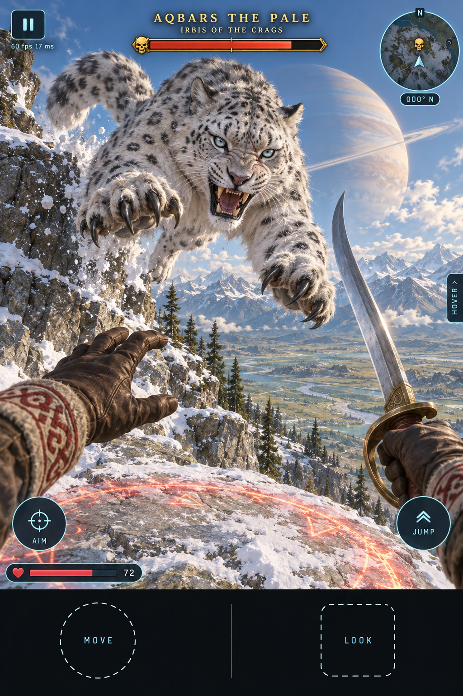
`art/nalati-grasslands/round-2/4-named-elites/elite-1-aqbars-snow-leopard.png`

| | |
|---|---|
| **Where** | **The Crags**, the NE high ground: granite ledges above the spruce line. The lair is a ledge cave with old bones. Always present in daylight; at night it prowls down to the spruce edge. |
| **Species / size** | New `leopard` species on the quadruped rig, ×1.5 scale. Pale smoky fur with dark rosettes, a huge tail, ice-blue eyes and a muzzle scar. **700 hp.** |
| **Behaviour** | **Stalks along the ledges above you.** You mostly see the tail and hear the scrape of claws. It never approaches on flat ground if a ledge route exists. It is aware of you at 60 m and engages at 25 m. Leash 90 m. |
| **Signature: POUNCE** | From a ledge 3–8 m above you it crouches, its tail flicks and a **red-gold ring paints on the ground at your feet** (1.0 s). Then it leaps. Step out of the ring and it lands, skids and is **open for 1.5 s** (headshots ×3 during this window). If it hits, you take 35 damage and are pinned for 1 s. |
| **Other moves** | Swipe combo (2 hits of 14 at melee range); **tail-feint**: a false crouch with no ring, which baits an early dodge. |
| **Phase 2 (≤ 50 %)** | It snarls and **retreats up to a ledge you cannot reach**, then fights **hit-and-run**: pounce, one swipe, back up the rock. From now on it only takes damage **on the ground or in the air**. A bow shot mid-leap knocks it down (2 s stagger). |
| **Weak point** | Its airborne body: arrows mid-pounce do ×2 damage. |
| **Drop** | **IRBIS sabre skin** (pale frost steel with a rosette damascus pattern, a snow-leopard-fur grip) and the **snow-leopard pelt** trophy. This was the plan's legendary pelt. |
| **Achievement / title** | *Irbis*: "Kill Aqbars the Pale". Title: **Crazy Cat Person**. |

#### E2 — Kokbori, *Mother of the Pack* (the sky-grey she-wolf)

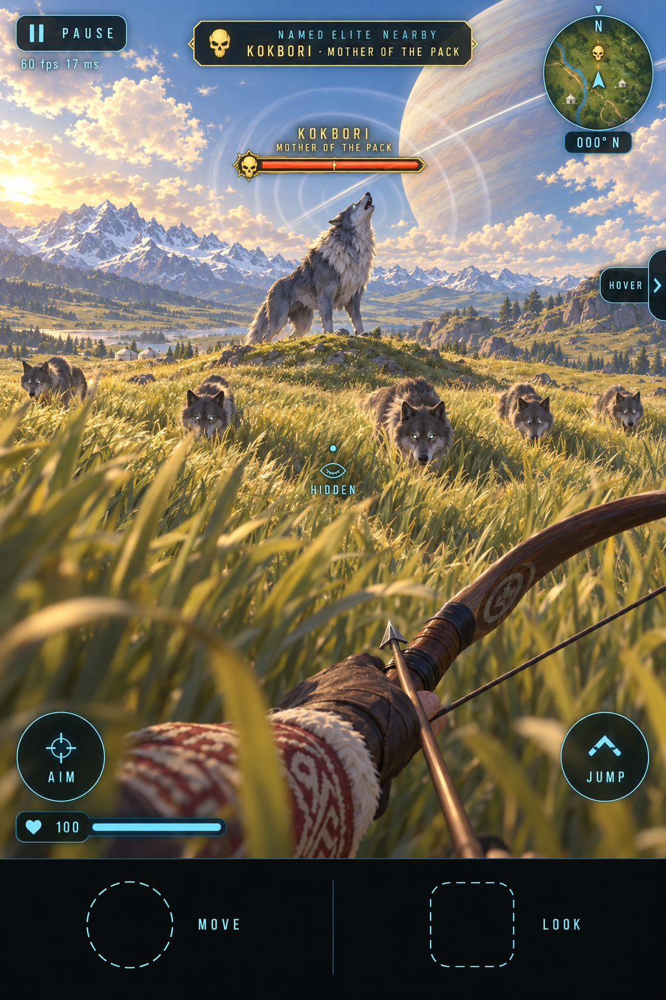
`art/nalati-grasslands/round-2/4-named-elites/elite-2-kokbori-sky-wolf.png`

*Kok bori*, the sky-grey wolf, is the ancestral she-wolf of Turkic myth.

| | |
|---|---|
| **Where** | **The tall-grass basin** west of the horse plains, where the grass is waist-high. The den is a rocky rise. She spawns **at dusk and at night** with a pack of 5. |
| **Species / size** | The Nalati `wolf` species with an elite variant, ×2 scale. Blue-grey coat, a silver ruff and pale eyes. **650 hp.** Her pack are ordinary 60 hp wolves. |
| **Behaviour** | She **hunts you through the grass**. She stays back 30–40 m while the pack closes in, and the pack is visible only as **parting waves in the grass** (F2 living grass). She repositions whenever you get a clear shot. |
| **Signature: PACK HOWL** | She raises her muzzle and **pale rings ripple out** (1.2 s). All wolves within 60 m converge and **flank**, and every one of them is marked on your minimap for the duration. Break it by **hitting her mid-howl**: that cancels it, staggers her and scatters the pack for 5 s. |
| **Other moves** | **Hamstring**: a lunge through the grass at your legs that slows you 40 % for 3 s; **grass ghost**: she crouches and disappears into tall grass, and only the grass wave shows her. |
| **Phase 2 (≤ 50 %)** | She **calls the pack back** to guard her (a ring of wolves around her) and **comes for you herself**. Every wolf you kill in this phase makes her faster, and every wolf alive makes her harder to reach. The kill-order choice is the fight. |
| **Weak point** | Stealth: an arrow while you are HIDDEN (crouched in tall grass, eye pip closed) does ×2 damage and does not reveal you. |
| **Drop** | **SKY-WOLF bow skin** (blue-grey horn limbs, wolf-fang nocks, a silver string) and the **grey mother's pelt** trophy. |
| **Achievement / title** | *Leader of the Pack*: "Kill Kokbori". Title: **Good Boy Denier**. |

The mockup also shows the **NAMED ELITE NEARBY banner** and the HIDDEN pip.

#### E3 — Qyran the Storm-Wing, *Berkut of the High Wind* (the golden eagle)

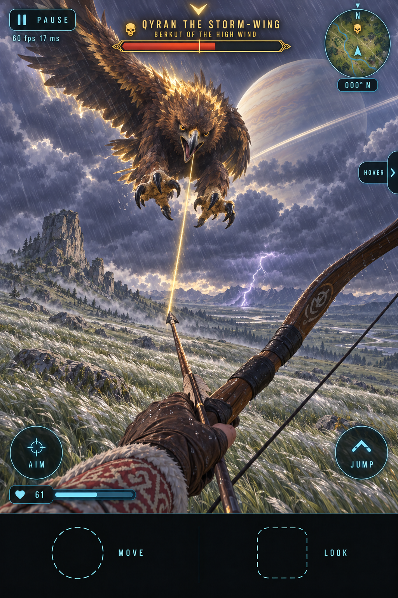
`art/nalati-grasslands/round-2/4-named-elites/elite-3-qyran-storm-wing.png`

*Qyran* is the Kazakh word for a hunting eagle. The eagle-hunter companion is skipped for now, and this is the wild eagle that
hunts **you**.

| | |
|---|---|
| **Where** | **Eagle Rock**, the lone tor. It spawns **only during a steppe storm** (the storm feature), so it is the storm's reason to be outside. The nest is on the tor's summit. |
| **Species / size** | New `eagle` flier with a 5 m wingspan (the `Gulls.ts` bird, scaled, with a real flight model). Golden nape feathers that glow. **600 hp.** |
| **Behaviour** | It circles 40–60 m up, riding the storm wind: its flight path drifts downwind, which teaches you to lead for wind. It hunts anyone in the open, and **grass stealth does not work on it**, because it sees from above. |
| **Signature: STOOP** | It folds its wings. A **gold line streaks from the eagle to you** and a **gold chevron glows at the screen edge** it is coming from (1.2 s). Then it dives at about 40 m/s. **Dodge sideways** at the last moment and it hits the ground, **grounded and flapping for 2 s**. If it hits, you take 30 damage and are knocked down; if you are riding, you are thrown from the horse. |
| **Other moves** | **Storm feathers**: it rides a gust and sheds razor feathers in a line (3 × 8 damage); **snatch**: it carries off your horse's saddlebag, which drops loot you can chase down. |
| **Phase 2 (≤ 50 %)** | It flies **into the storm cloud**. Visibility drops, it stoops out of **lightning flashes**, and each strike's tell is only the chevron and the lightning. The wind gets stronger, so arrow drift doubles. |
| **Weak point** | Grounded: every hit while it is on the ground is a headshot. |
| **Drop** | **STORM-WING arrow skin** (golden fletching and a gold streak trail on every arrow) and the **golden eagle feather** trophy. |
| **Achievement / title** | *Clipped*: "Kill Qyran the Storm-Wing". Title: **Birdwatcher (Aggressive)**. |

#### E4 — ~~Tas Ata, *the Stone Father*~~ (dropped 2026-09-22)

The user dropped the balbal giant. The **Balbal Circle keeps its ordinary balbal warriors**: they wake at dusk, are
2.5 m tall with 220 hp, and have amber cracks that the sabre and the spear break. That keeps the *Stonebreaker* achievement
(5 balbals). The `balbal` rig is still needed, for those warriors and for the Golden King's phase-2 adds. The round-2 mockup
stays on disk as history: `art/nalati-grasslands/round-2/4-named-elites/elite-4-tas-ata-stone-father.png`.

The fifth slot goes to **one of the two candidates below**. Each has one mockup, and the user picks.

#### E4a — Argymaq the Unbroken, *Stallion of the High Crags* (the feral black stallion) — candidate

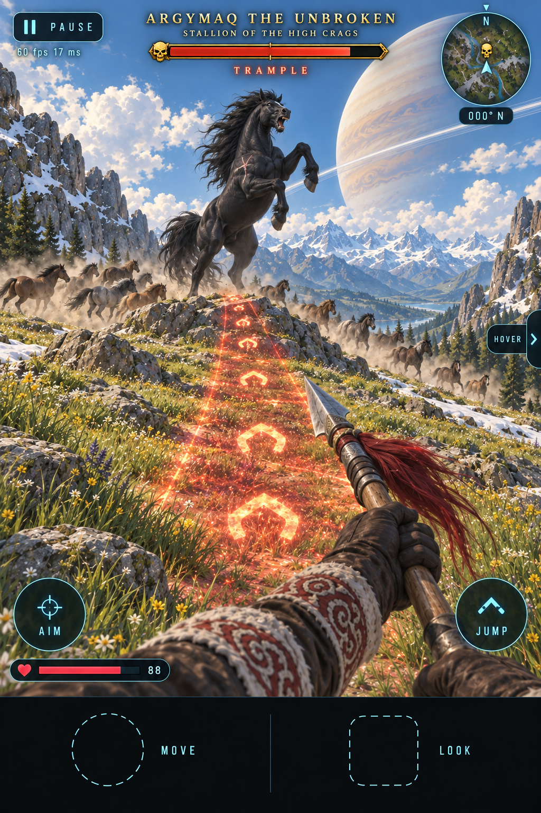
`art/nalati-grasslands/round-3/1-elite-swap/elite-stallion-argymaq-the-unbroken.png`

*Argymaq* (арғымақ) is the Kazakh word for a noble, pure-blooded steed, the horse of the epics. He is a living horse,
**not a ghost**: that is Qara Batyr's side of the roster. He leads a wild herd that nobody has ever ridden.

| | |
|---|---|
| **Where** | **The high crag pastures**: the grassy saddle and snow-patch meadows on the Crags' western shoulder (+40…+55 m), above the Sky Grassland and below Aqbars' ledges. Aqbars keeps the rock above +55 m, and the two leashes do not overlap. He is always there in daylight. At night the herd beds down in a hollow and he stands sentinel on a rock. |
| **Species / size** | The Nalati `horse` species (the F1 `Mount` quadruped rig), with an elite variant at ×1.3 scale: a glossy blue-black coat, a wild tangled mane, and a white scar on the shoulder. No saddle and no bridle. **750 hp.** His herd is 10–12 ordinary wild horses (duns, bays and greys). |
| **Behaviour** | He is aware of you at 80 m. Inside 40 m he puts himself between you and the herd, and the herd wheels away along the ridge. Leash 100 m. Ordinary taming does **not** work on him: the TRUST arc never appears until he has been beaten. |
| **Signature: TRAMPLE** | He **rears** on a rock and screams, and a **red-gold lane with hoof-print chevrons paints from his hooves to your feet** (1.2 s). Then he charges down it at 18 m/s: 35 damage and a knockdown, and if you are mounted your horse is bowled over and you are thrown. Sidestep out of the lane and he overshoots, skids and turns, **open for 1.5 s**. Or **BRACE the spear in the lane**: he pulls up short on the point, which staggers him for 2.5 s and does 60 damage, and you take none. |
| **Other moves** | **Hoof strike**: he rears at melee range and lands two forehoof blows (2 × 15). **Herd call**: the whole herd stampedes through the pasture along a wide lane, telegraphed by a dust wall and a ground rumble (12 damage per horse that hits you). |
| **Phase 2 (≤ 50 %)** | **He runs.** He breaks away and gallops the pasture loop at the head of the herd. On foot you cannot catch him, so you need your own horse. Riding alongside him, he kicks and bites your horse (STEED −15 % each time) and cuts across your path with Trample lanes. |
| **Weak point** | His recovery. Every hit during the post-Trample skid or the brace stagger does ×2. |
| **Beaten, not killed** | At 0 hp he **does not die**. He stops with his head low and his flanks heaving, and the bar turns grey and reads `BROKEN`. Then the ordinary taming flow starts (`taming-1…3` in `wolves-horses-taming.md`), with harder bucking than a plains stallion. Hold on and he is **yours**. Get thrown and he bolts, then comes back at 50 % with the fight in phase 2. |
| **Drop** | **Argymaq himself**, as a mount: the best horse in Nalati (+15 % gallop speed, +40 % STEED, and he **never panics**, not at wolves, not at Qara Batyr's wail, not at the Storm Titan's grass fire). Plus the **black mane braid** trophy, which hangs from your saddle. There is no skin, because the horse is the reward. |
| **Comes back?** | No. He is a **one-time elite**. Once he is tamed, the crag herd gets an ordinary lead stallion, the gold skull on the map becomes a horse icon, and his lair is no longer a lair. |
| **Achievement / title** | *Unbroken, Until Now*: "Tame Argymaq". Title: **Horse Whisperer (Shouting)**. |

**For:** it is the most Nalati thing on the list. The horse is the heart of the shard, and the reward is the only one no
other elite can give: a better horse, which turns the mounts feature into a progression. It is cheap, because it reuses the
horse rig, the herd AI and the taming flow, which are all being built anyway (N6).
**Against:** it overlaps the plains herd stallion. That stallion is also black in round 2, and the tamed horse's default
name is TULPAR. If Argymaq is picked, the plains stallion should become a **dun or a grey**, so that "the black stallion"
always means Argymaq. It also means owning more than one horse (see `wolves-horses-taming.md`, open question 2). It makes the
roster horse-heavy too: Qara Batyr and the Storm Titan are both mounted fights already.

#### E4b — Qonyr the White-Claw, *Keeper of the Spruce* (the Tian Shan brown bear) — candidate

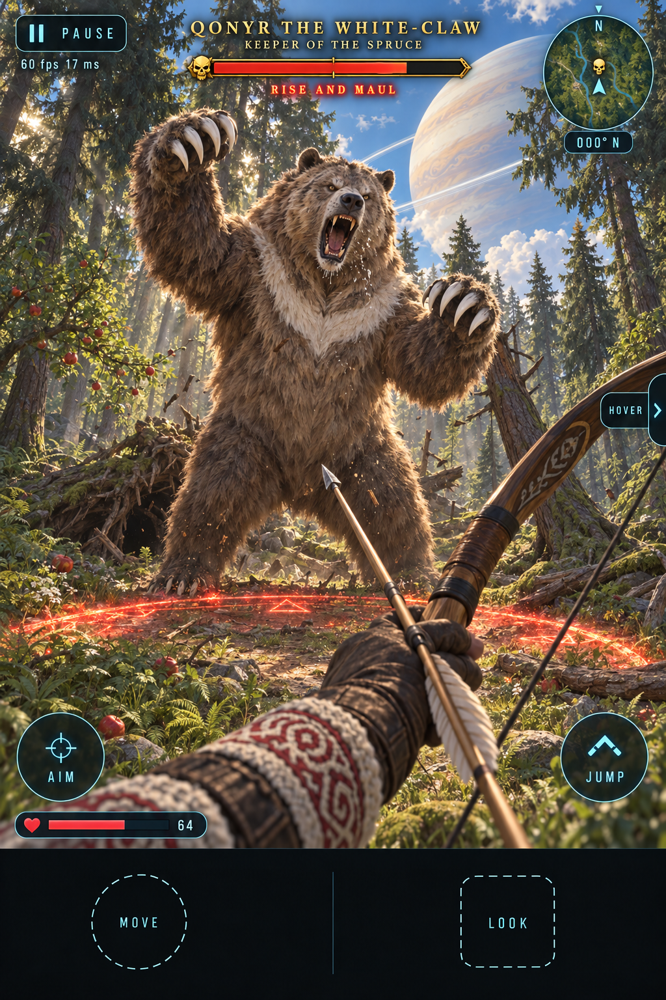
`art/nalati-grasslands/round-3/1-elite-swap/elite-bear-qonyr-the-white-claw.png`

*Qonyr* (қоңыр) means brown, and "qonyr ayu" is how Kazakhs name the brown bear. The Tian Shan brown bear (*Ursus arctos
isabellinus*) is pale sandy-silver and is called the **white-clawed bear**, because its long claws really are pale.

| | |
|---|---|
| **Where** | **The spruce forest**: the east gully on the north-facing escarpment. His den is under the root-plate of a fallen giant spruce, next to a grove of **wild apple trees** (the Tian Shan is where the apple comes from, *Malus sieversii*). He is always there. At dusk he feeds in the apple grove, and you can find him unaware, which gives stealth an opener. The spruce band has no elite otherwise. |
| **Species / size** | Pine Hollow's `bear` species with a Nalati elite variant at ×1.5: a pale sandy-silver and honey-brown coat, a cream crescent collar on the chest, long **white claws** and a greying muzzle. **900 hp** (a Pine Hollow bear has 220–480). |
| **Behaviour** | He is **territorial, not a hunter**: he ignores you beyond 40 m. Inside 40 m he **bluff-charges** once and stops 3 m short. If you stay, or if you shoot, the fight starts. Leash 70 m. He uses the forest: he smashes young spruces, and fallen trunks stay on the ground as cover and obstacles. |
| **Signature: RISE AND MAUL** | He **rises on his hind legs** to 3.5 m and roars, and **a wide red-gold arc paints on the forest floor in front of him** (1.3 s). Then both forepaws slam down: 40 damage and a knockdown, and any young spruce inside the arc is felled. Back out of the arc, or **shoot the cream chest collar while he is up**: that interrupts the maul, staggers him for 2 s and does ×3. |
| **Other moves** | **Bluff charge**: a charge lane that stops 3 m short. The *second* charge in a row is always real (30 damage and a knockdown), so the fight teaches you to read which one is coming. **Spruce fall**: he shoulders a spruce and it topples along a painted lane (30 damage). The trunk stays. |
| **Phase 2 (≤ 50 %)** | He **stops rearing** and fights on all fours. He is faster, uses swipe combos (3 × 14), and every real charge fells the spruces along its lane, so **the clearing shrinks as the fight goes on**. From now on, a **braced spear** on a real charge does ×4 and stuns him for 2 s. |
| **Weak point** | The chest collar, which is only exposed while he rears (×3), and the braced spear on a real charge. |
| **Drop** | **WHITE-CLAW spear skin** (a dark spruce-wood shaft, a pale steel head, and a collar of white bear claws lashed with red cord). It inherits Tas Ata's spear slot, so every elite still drops a skin for a different weapon. Plus the **Tian Shan bear pelt** trophy, which becomes a rug at camp. |
| **Achievement / title** | *Grin and Bear It*: "Kill Qonyr the White-Claw". Title: **Unbearable**. |

**For:** it gives the spruce forest a reason to go in, and gives the spear the showcase that Tas Ata used to give it. It keeps
the fifth elite **on foot**, which balances a roster that already has two mounted fights. It is cheap, because it reuses
Pine Hollow's bear species and its `stalk` AI.
**Against:** Pine Hollow already has bears, so it is the less Nalati-specific of the two, and its reward is only a skin.

**Recommendation:** **Argymaq**, but only just. The horse is what Nalati is about, and "win the fight, then win the horse"
is a new verb that no other elite has. Pick **Qonyr** if the roster feels too horse-heavy with Qara Batyr and the Storm Titan,
or if the forest band needs a reason to be visited.

#### E5 — Qara Batyr the Unburied, *Captain of the Night Riders* (the ghost-rider captain)

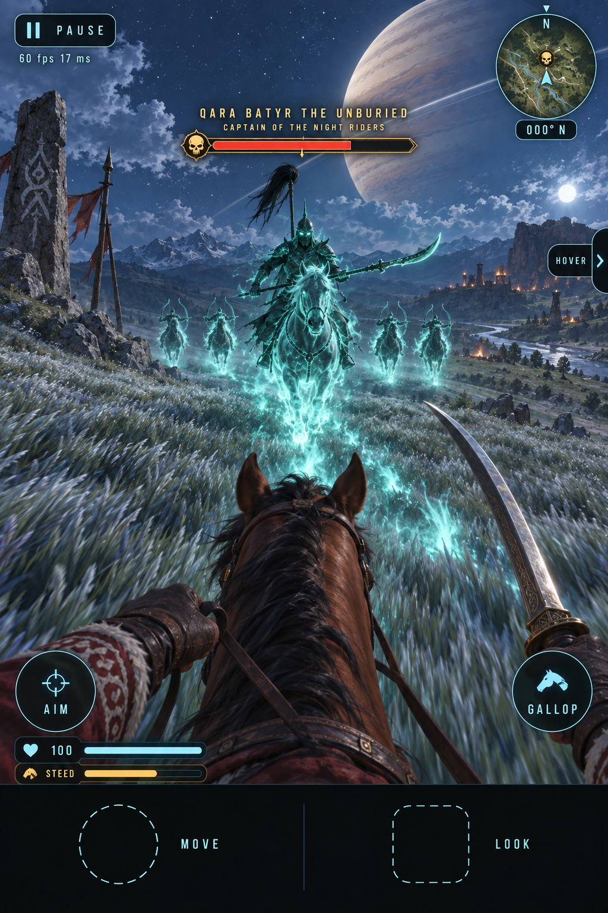
`art/nalati-grasslands/round-2/4-named-elites/elite-5-qara-batyr-night-rider.png`

*Batyr* means a hero-warrior, and *qara* means black. He leads the ghost riders.

| | |
|---|---|
| **Where** | **The ridge lines, at night.** He rides at the head of the ghost-rider line when it forms. The spawn rule: **once you have killed 5 ghost riders** in a night, the next line forms with him leading it. His lair on the map is the ridge's burial cairn. |
| **Species / size** | A spectral rider on a spectral horse (the `Mount` rig from F1 with a ghost material: translucent teal, fresnel rim). A horsetail standard (*tug*) and a glaive. **800 hp.** |
| **Behaviour** | A **mounted duel**. He circles at gallop and his four riders loose arrows you can see coming. On foot he outruns you, so **you need your horse**, which makes this the test of mounted combat. |
| **Signature: DEATH CHARGE** | He wheels, lowers the glaive and **a lane of cyan ghost-fire burns across the grass toward you** (1.3 s). Then he charges down it (38 damage, and you are thrown from the horse). Swerve out of the lane at a gallop and he passes you with his **back open for 2 s**. A sabre slash at that moment does ×3. |
| **Other moves** | **Volley**: his riders fire a line of arrows (visible tracers; 10 each); **wail**: his standard shrieks and your horse panics (the steed stamina bar drains 30 %). |
| **Phase 2 (≤ 50 %)** | He **dismounts his spectral horse**, and the horse becomes a separate add that keeps charging you. He fights on foot with the glaive, and the ghost riders ride circles around both of you. |
| **Weak point** | The standard: shooting the horsetail standard off his back (a small target, 150 hp) **ends the volleys** and makes his charges visible from farther away. |
| **Drop** | **NIGHT RIDER mount skin** (black barding with a faint spectral mane that glows cyan at night) and the **captain's standard** trophy, which you can plant at camp. |
| **Achievement / title** | *Ride the Night*: "Unhorse Qara Batyr". Title: **Night Shift**. |

---

## 2. The boss system (engine)

A boss is a **set-piece**: a place, an entrance, a fight with a shape, and a reward that changes how you play. There are
**one or two per shard** (the rule used to be one per shard; the user's 2026-09-22 decision gives Nalati two). Each boss is
a legendary weapon source, and each tests a different half of the shard. Nalati's Golden King is the **on-foot** exam,
underground. Jel Ata, the Storm Titan, is the **mounted** exam, under the open sky. A shard with two bosses must make them
**different kinds of fight**, not two sizes of the same one. Two bosses never share an arena, and only one boss bar is ever up.

### Parts of a boss

1. **An arena.** An enclosed volume (a box or a cylinder in shard coordinates) with its own `build()`, colliders,
   `floorHeightAt` and lighting, following the POI file pattern. It has a **threshold**: crossing it starts the fight and
   **seals the arena**. For the Golden King, sand pours over the doorway. For the Storm Titan it is an **open-air** arena: a
   160 m circle of the Sky Grassland, sealed by a ring-shaped **storm wall**. While sealed, the minimap swaps to an arena
   mini-plan.
2. **An intro beat (the name card).** Input locks for **3.5 s**. The camera stays first person (no cutscene camera, which
   keeps it cheap and consistent) but eases to face the boss. The top HUD fades out, a black letterbox band slides in, and the
   boss performs its rise. A **name card** fades in: a big engraved-gold name, ornamental rules, an emblem and the boss's
   title. A boss music track starts. `HOLD TO SKIP` is available, and **every retry plays a 1 s short version**.
3. **The boss bar.** Pinned across the top, just below the PAUSE / minimap row, about 80 % wide, in a heavy ornate gold frame.
   The name sits above it in large engraved gold capitals and **engraved notches split it into phase segments**. A shield or
   invulnerable state shows as a gold shimmer over the bar. A "PHASE II" caption appears on each phase change. While a boss
   bar is up, no named elite bar can show.
4. **Multi-phase: three phases.** Each phase change is a **beat**: 1.5 s invulnerable, the arena itself changes, and a new
   move set starts. The phases are designed as *what the room becomes*, not only *what the boss does*.
5. **Adds.** Ordinary enemies spawned through `animals.spawn(kind, x, z, yaw, variant)`, with the normal cyan bars. They can
   be a gate (for example, "the boss is shielded while adds stand").
6. **Arena hazards.** Sand, light beams, whirlwinds, grass fire and roots, each telegraphed the same way as elite moves (a ground decal,
   then the effect).
7. **Checkpoint and retry.** Death inside the arena does **not** send you back to the shard spawn. You respawn **at the arena
   door** with full health and **arrows refilled**, and the boss resets to full. A retry card shows ("THE KING ENDURES", the
   attempt number) and the short intro plays. Leaving the arena through the pause menu is always allowed and resets the fight.
8. **The legendary reward.** It is a **new weapon**, a real unlock through `Weapons.unlock`, following the iron-sword
   pattern. It is not a skin. It comes with a **reward card** (LEGENDARY, the name and one flavour line), a pickup prompt, the
   achievement and title toast, and the arena unseals. A re-fight is allowed and gives trophy loot only.

### The Golden King fight, step by step

**Place.** The **great kurgan** in the Kurgan field. You get in through a looter's tunnel in the mound's flank, then a
timber-lined *dromos* (entrance corridor) with dormant balbals in niches and gold offerings. That corridor is where the
checkpoint is. The burial chamber is a 20 × 20 m room of massive larch logs, with a shaft of daylight from the looter's
hole in the roof, a hollowed-larch log coffin in the centre, and gold everywhere. The design is based on the real Issyk
"Golden Man" and Berel kurgans.

**0 — Threshold.** You step off the dromos into the chamber. The doorway **fills with pouring sand** behind you (sealed). The
light shaft brightens.

**1 — Intro (3.5 s).**

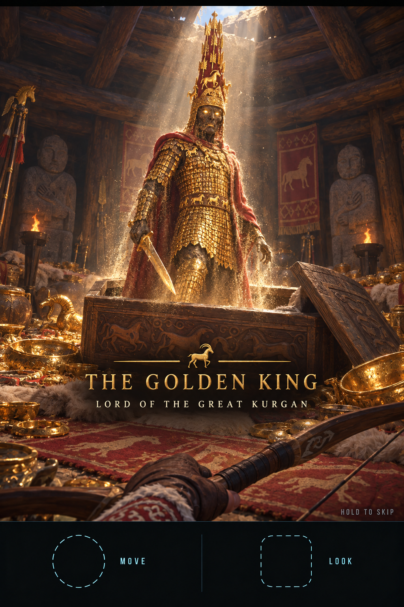
`boss-1-name-card.png`

The coffin lid grinds aside and the King **sits up, then stands** in the light shaft, shedding gold dust, and his eyes
ignite. **THE GOLDEN KING, Lord of the Great Kurgan.**

**2 — Phase I, "The King's Court" (100 → 60 %).**

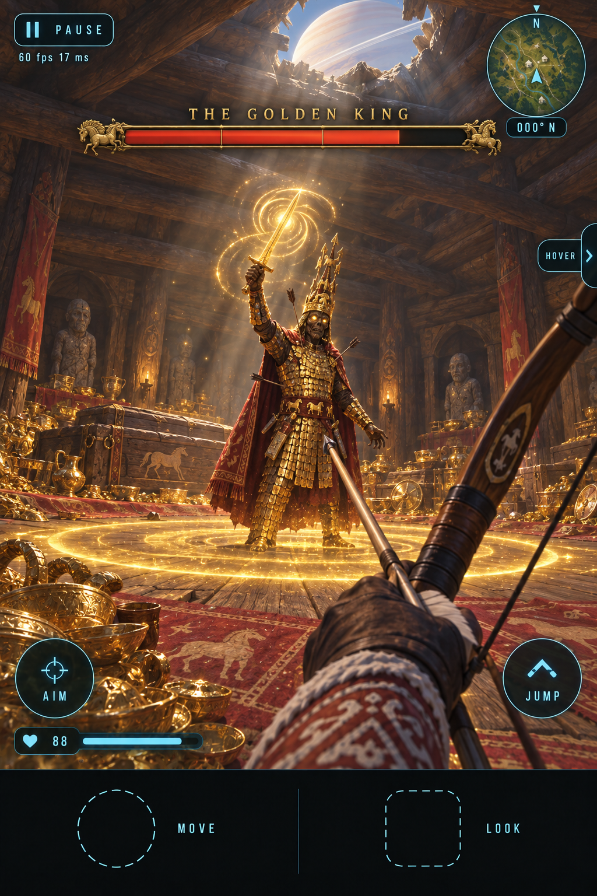
`boss-2-phase-1.png`

He duels you on the open floor.
- **Akinakes combo**: three sword strikes (14 / 14 / 22). Before each one the blade **glints**, and the third strike's wide
  arc is painted on the floor.
- **Sunburst**, the signature move: he raises the sword, gold light spirals into it, and **a gold ring expands across the
  floor** from his feet (1.2 s). **Jump it** (25 damage and a knockdown if it catches you).
- Gold scale armour takes **half damage from arrows**. His **face takes ×2.5** (a headshot), and each **sabre hit knocks
  plaques loose**. After enough plaques come off, a patch of his chest takes full damage.

**3 — Phase II, "The Kurgan Wakes" (60 → 30 %).**

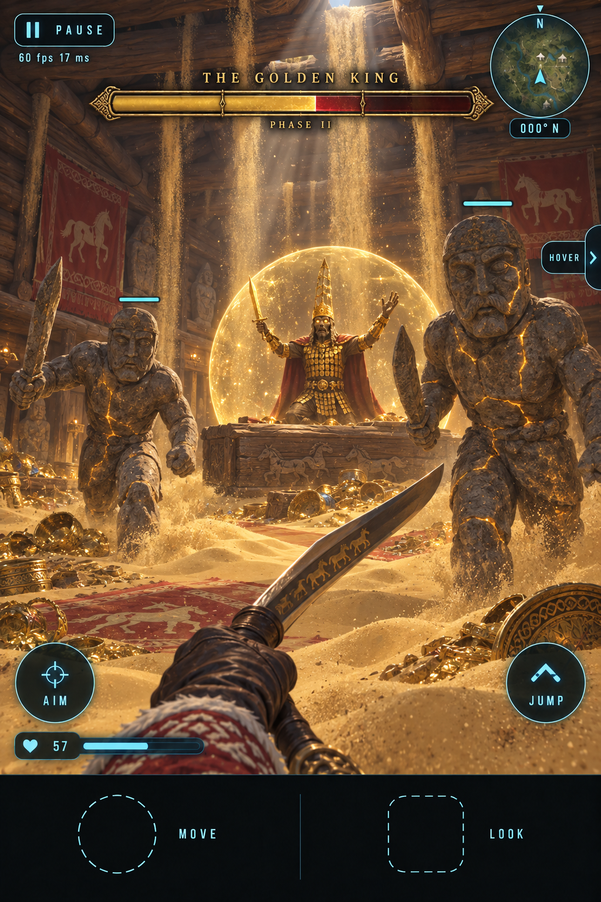
`boss-3-phase-2.png`

He staggers back to his coffin and kneels behind a **dome of gold light**: he is shielded, and the bar shimmers.
- **Balbal adds**: two balbals step out of the wall niches (2.5 m, 220 hp each, amber cracks, the sabre breaks them). Then
  two more if you are slow. **The shield holds while any balbal stands.**
- **Sand flood** (the hazard): sand pours in streams through the gaps in the ceiling logs, and **drifts build on the floor**,
  marked by a gold shimmer a second before a stream starts. Sand slows you 50 %. The log beams and the coffin plinth are the
  high ground.
- When the last balbal falls, the dome breaks and he is **stunned for 4 s** (full-damage window).

**4 — Phase III, "The Gold Burns" (30 → 0 %).** The drifts stay, and he **tears off his cloak**.
- He is **faster**, the combo gains a fourth strike, and the Sunburst now fires **two rings** (jump, land, jump).
- **Sun beams** (the hazard): the looter's-hole light becomes a **burning beam that sweeps the floor** in a slow arc, and a
  thin gold line shows its path. Luring him through it does 50 damage to *him*.
- His headdress glows. **Shooting it off** (a 200 hp sub-target) drops him to one knee for 3 s.

**5 — Victory.**

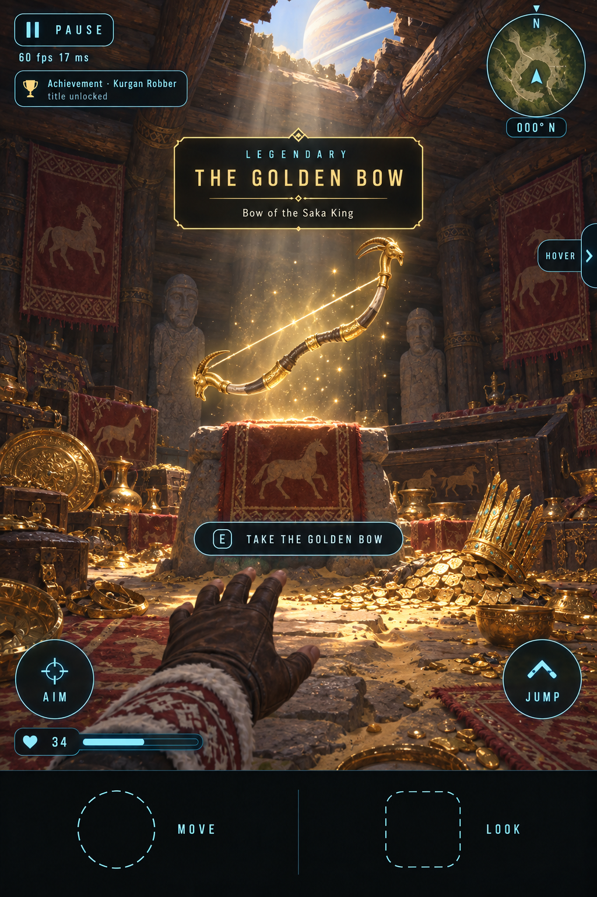
`boss-4-victory-reward.png`

He crumbles into a heap of gold plaques and his headdress topples. The sand drains through the floor and the doorway
clears. The light shaft falls on a felt-draped pedestal: **THE GOLDEN BOW**, a Scythian recurve with golden ibex-head limb
tips and a string of light, inside a gold legendary orb.
- Reward card: `LEGENDARY · THE GOLDEN BOW · Bow of the Saka King`. The prompt reads `TAKE THE GOLDEN BOW`.
- Achievement **Kurgan Robber** ("Defeat the Golden King"), title **Grave Robber (Licensed)**, plus the **gold plaque**
  trophy.
- **The Golden Bow**, a new weapon: it draws 20 % faster than the recurve. A full draw fires a **sun arrow** that pierces
  through one target and leaves a gold streak, which is the visual reward. A sun arrow into a balbal's amber crack shatters
  it.

**Retry.** When you die, the "THE KING ENDURES · attempt 2" card shows and you respawn in the dromos with full health and 30
arrows. The King is back at 100 % and in his coffin, the short intro plays, and the phase layout resets.

### The Storm Titan fight, step by step (the second Nalati boss)

Round-2 concept: `art/nalati-grasslands/round-2/5-bosses/boss-5-alt-storm-titan.png`. The full round-3 set is in
`art/nalati-grasslands/round-3/2-storm-titan/`.

*Jel* means wind and *ata* means father: **JEL ATA, the Storm Titan, Father of the Wind**. He is the steppe storm given a
body: a 60 m nomad warrior of churning storm cloud, with a pointed helmet, a cloud beard and cloak, eyes of white lightning,
a **lightning heart** in his chest and a spear of lightning. The Golden King is the on-foot exam underground. Jel Ata is the
**mounted exam under the open sky**, and the only boss the mounts feature makes possible.

**Place.** The **Sky Grassland** (the treeless plateau in the south half of the slab, +30…+36 m, see
`geography-and-map.md`). The arena is a **160 m circle** on the plateau's south-central part, against the south rim.
**Jel Ata never stands on the terrain.** He rises out of the cloud sea **beyond the rim**, outside the slab, 120–200 m from
the player. So he needs no pathing and no terrain collision: he is a far-field set piece whose strikes land inside the
arena. The threshold is the **Wind Cairn** on the rim: a stone cairn with poles hung with tied white and blue cloth strips
(tying a strip at a sacred place is a real custom across the steppe).

**0 — Threshold.** Ride up to the cairn **mounted**. The prompt reads `TIE A CLOTH STRIP`. On foot it reads "The wind wants a
rider" and nothing happens. Tying the strip **calls the storm**, whatever the weather or the hour: the steppe-storm preset is
forced on, the sky darkens over 5 s, and a **storm wall** (a ring of whirling grey cloud, 80 m radius) rises around you. That
is the seal. Riding into the wall throws you back with 10 damage. The checkpoint is the cairn.

**1 — Intro (3.5 s).**

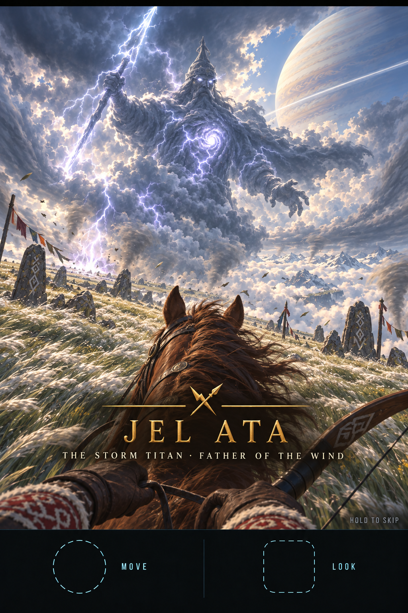
`round-3/2-storm-titan/titan-1-name-card.png`

The cloud sea beyond the rim boils up into a column, and he **rises from the waist up**. His eyes ignite and the first bolt
hits the meadow. **JEL ATA, The Storm Titan · Father of the Wind.** The name card uses the Golden King's layout with a
lightning-and-spear emblem. You stay in the saddle through the intro, and the horse sidesteps and snorts.

**2 — Phase I, "The Sky Spear" (100 → 60 %).**

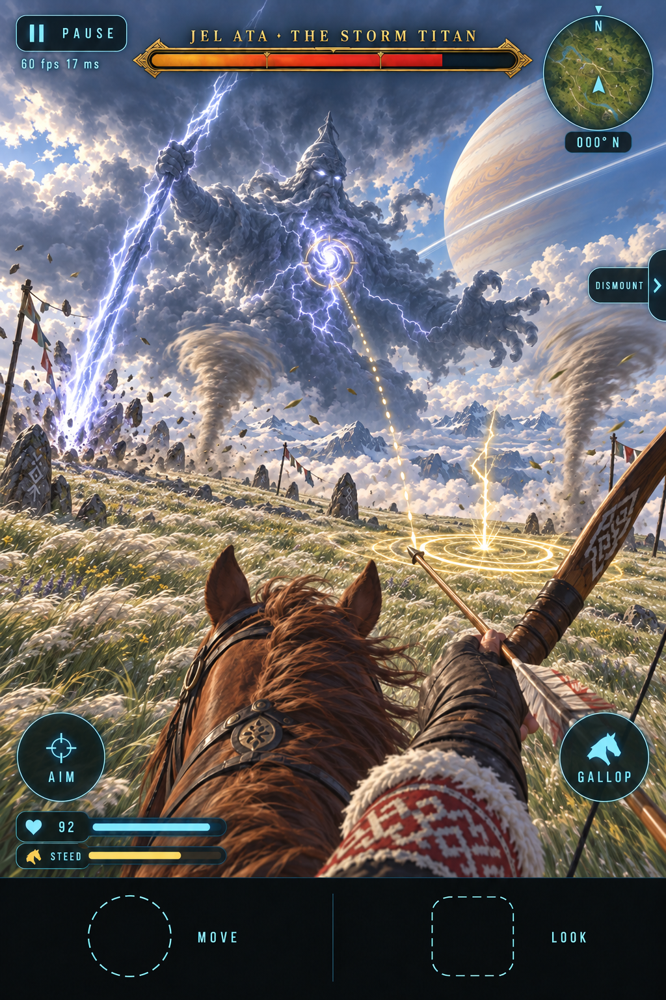
`round-3/2-storm-titan/titan-2-phase-1.png`

The verb is **horse archery at a gallop**.
- **His cloud body is immune.** Arrows pass through it in a puff, with a grey `IMMUNE` float. Only the **lightning heart**
  takes damage.
- **Sky Spear**, the signature move: he raises the spear and a **gold-white forked ring paints on the grass** where it will
  land (1.5 s). The ring **tracks you until 0.5 s before the strike**, so standing still or riding a straight line gets you
  caught. Keep turning at a canter or faster. A hit does 40 damage and throws you from the horse.
- **The punish window**: after each strike the spear is **stuck in the meadow for 3 s**. He is bent over it, so his chest is
  only 25 m up and 50–70 m away, and the **heart opens** (it blazes, with a gold target ring). Arrows into the open heart do
  full damage, and a full-draw shot counts as a headshot (×2.5).
- **Whirlwinds** (the hazard): 2–3 grey dust devils wander the circle. Touching one lifts you out of the saddle (15 damage).
  The **wind** (the F2 wind object) drifts arrows, as in Qyran's fight, so you have to lead for it.
- **Thrown from the horse?** The horse bolts 30 m away and comes back when you whistle (the HORSE tab or X). On foot you are
  slow and the forked rings catch you, so getting back into the saddle is part of the fight.

**3 — Phase II, "The Three Winds" (60 → 30 %).**

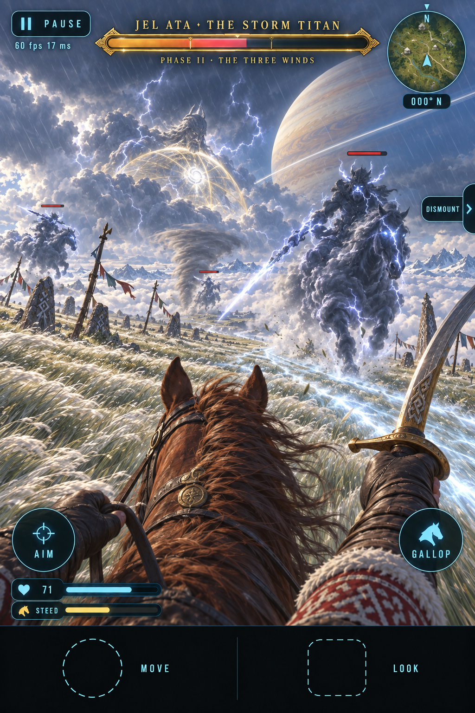
`round-3/2-storm-titan/titan-3-phase-2.png`

He thins into a pale translucent giant and **kneels at the rim**. His heart closes behind a **gold-white dome of wind**, so he
is shielded and the bar shimmers. **Three storm riders** tear off him: 8 m cloud horsemen on cloud horses, each with a
lightning spear, 250 hp each, with normal cyan bars. The verb is the **mounted sabre**.
- They circle you at a gallop. Each one's **Wind Charge** paints a **cyan-white lane across the grass** (1.2 s) and then charges
  down it (30 damage and you are thrown). **Swerve out of the lane**, and as the rider passes its flank is **open for 2 s**.
  A sabre slash on the pass does ×3. Arrows do half damage to them.
- Each rider is a piece of him. A rider falling takes **8 %** off his bar. **The dome holds while any rider stands.**
- Rain comes down and visibility drops to about 90 m, so a rider behind a whirlwind is a real threat. The riders' lanes also
  show as **cyan chevrons on the screen edge** when they come from behind (the same cue as Qyran's stoop).
- When the last rider falls, they stream back into him. The dome breaks and he is **stunned for 4 s with the heart open**
  (a full-damage window that takes the last ~6 %).

**4 — Phase III, "The Grass Fire" (30 → 0 %).**

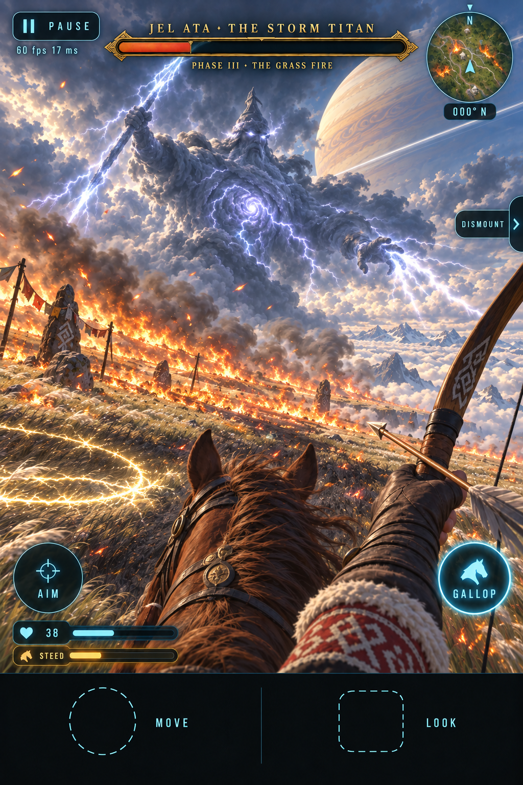
`round-3/2-storm-titan/titan-4-phase-3.png`

He stands whole again, enormous and furious, and the lightning **sets the plateau on fire**.
- **Grass fire** (the hazard): fire fronts spread **downwind**, and a cyan wind arrow on the minimap rim shows the direction.
  Burning grass does 8 damage per second, the horse **panics** (STEED drains, and it refuses to cross a fire line), and the
  smoke hides the forked rings. **Burned black grass is safe ground**, and there is more of it the longer the fight goes, so the
  phase is a race: ride **upwind** onto the black.
- **Chain lightning**: both hands hurl bolts. A **chain of strike rings trails your path**, each landing 0.6 s after it
  paints. Stopping means being hit. The Sky Spear continues between chains.
- The **heart is permanently open** now but moves as he strides, so this is the shoot-while-fleeing phase: the Parthian shot
  from F1, twisting back in the saddle.
- **The bar hits 0 when the heart breaks.**

**5 — Victory.**

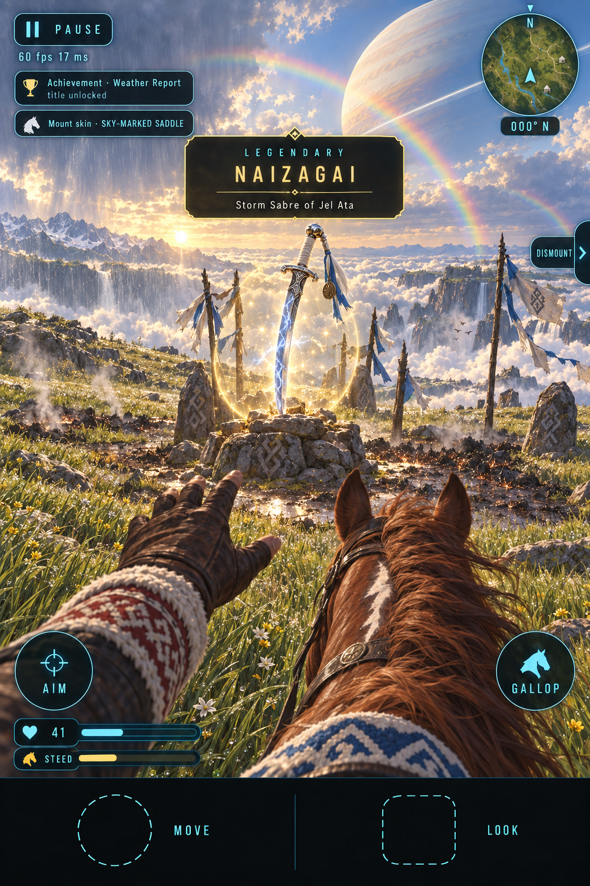
`round-3/2-storm-titan/titan-5-victory-reward.png`

He comes apart into a **curtain of soft rain** that drifts off over the cloud sea and puts the fires out. The sky tears open
into evening gold, with a rainbow and the gas giant huge and clear. The storm wall drops. At the Wind Cairn, in a ring of
scorched grass, **NAIZAGAI** stands point-down in the earth, inside a gold legendary orb.
- Reward card: `LEGENDARY · NAIZAGAI · Storm Sabre of Jel Ata`. The prompt reads `TAKE NAIZAGAI`. (The mockup leaves the prompt pill out.)
- Achievement **Weather Report** ("Defeat Jel Ata, the Storm Titan"), title **Partly Cloudy**.
- **The trophy is the SKY-MARKED SADDLE**, a mount skin: your horse gets a white lightning-fork blaze on the forehead and a
  white-and-blue felt saddle cloth. It is cosmetic, and it is how the world can see that you beat the storm.
- **Naizagai** (найзағай, "lightning" in Kazakh; *nayza* alone means spear) is **a new weapon**, a legendary sabre in the
  sabre slot, unlocked through `Weapons.unlock` like the Golden Bow. It is the user's "storm sabre" option, and it replaces the
  round-2 storm-lance idea, because the lance duplicated the spear and the sabre is the mounted weapon. What it does:
  - **Mounted, at a full gallop**, every slash throws a **lightning crescent** 15 m forward along your look. It does 40 damage
    and **arcs to one more target** within 6 m.
  - **On foot**, a full HEAVY charge (the AIM latch) **calls a bolt** where you are looking, within 25 m. A 0.6 s ring paints
    first, then the strike does 60 damage in a 3 m radius. Balbals' amber cracks shatter.
  - **In a steppe storm** it does +25 % damage and the crescent arcs twice. It gives the storm a reason to ride out into it.
  - Cost: a uniform-only blade material (pale blue steel with white fork damascus), one additive crescent quad, and the
    Titan's pooled lightning strips. No new shader programs.

**Retry.** When you die, the "THE STORM RETURNS · attempt 2" card shows and you respawn **mounted** at the Wind Cairn with full
health, a full STEED bar and 30 arrows. The fire is out, he is back at 100 % below the rim, and the short intro plays.

**Why it earns a boss slot and not an elite slot:** it has three phases that each change the *arena* (open meadow →
rain and riders → fire and black ground), it has its own seal and checkpoint, and its reward is a weapon, not a skin.

**60 FPS budget.** This is the heaviest scene in Nalati: an open-air arena, so the world cannot be culled the way it is in
the kurgan. What keeps it affordable:
- the plateau is treeless by design (`geography-and-map.md`, lever B);
- the storm's fog and rain cut the view to ~90–150 m, so far terrain and grass drop to their lowest LOD;
- the titan is **one skinned mesh with a cloud shader** (fbm-eroded alpha, a fresnel rim, the internal lightning glow as
  emissive), not a volumetric;
- the lightning is pooled line strips, and each whirlwind is one spiral card system;
- the grass fire is a **128 × 128 burn field** (a texture updated every 100 ms) that the grass shader samples for its
  burn colour, plus additive fire cards along the front, with a hard cap on smoke particles.

Phase III is the worst case, so it needs a **phone perf test early**, before the art is final.

### One more boss concept, for later

| | concept | where | the fight | mockup |
|---|---|---|---|---|
| **Pine Hollow** | **The Antler King, Warden of Pine Hollow** | An old-growth clearing in the fog | A 7 m moss-and-bark elk guardian with a hollow glowing ribcage (the weak point). Root-ring stomps, lanterns in the antlers that become hazards when they fall, and summoned wolves. It would give Pine Hollow a boss and would make the Ghost stag and Old Ironhide its named elites. | `round-2/5-bosses/boss-6-alt-antler-king.png` |

The **Antler King** is the design to use when Pine Hollow gets its boss.

---

## 3. Engine notes: what exists and what is new

### Already in the engine, and reused

| piece | where | reused for |
|---|---|---|
| Species registry, `VariantDef` (`label`, `rarity: 'legendary'`, `hp`, `tint`, `fur`, `traits`, `mods`) | `src/entities/species/registry.ts` | an elite is a variant of its species (tint, scale, hp) |
| One legendary alive per kind | `AnimalManager` (`hasLegendary`) | the "one alive" rule, generalised to a placed spawn |
| Custom `think(animal, ThinkCtx)` + `EnemyWorld` | the crab, monkey and sailor (`src/entities/Enemies.ts`) | every elite's and boss's AI |
| Guard radius, rise-from-hiding intro, drifting back home | `sailor.ts` (`hold.r`, `hold.guardR`) | elite leash / reset, and the King's coffin rise |
| Skins as uniform-only material overrides, `skinFor(kind, variant)`, `SkinLocker` | `src/player/Skins.ts` | elite drops (sabre, bow, spear, arrow and mount skins) |
| `WeaponPickup` with a `rare` (purple) orb | `src/player/WeaponPickup.ts` | the elite drop orb (a new gold `legendary` tier for the boss) |
| Found-weapon unlock (`IronSwordPickup` → `weapons.unlock`) | `src/player/IronSword.ts`, `main.ts` | the Golden Bow |
| Achievements with a `variant` match plus joke titles | `src/game/achievements.ts`, `src/game/Progress.ts` | elite and boss achievements (a new `NALATI` table) |
| Head-anchored health bars, floats, MISS | `src/ui/Combat.ts` | the named elite bar is a new *style* of the same pooled bar |
| White ring for rare / legendary dots | `src/ui/Minimap.ts` | replaced by skulls for elites |
| `hud.toast`, `hud.killFeed`, `music.sting` | `src/ui/HUD.ts`, `src/audio/Music.ts` | the banner and boss stings |

### New

| piece | what | size |
|---|---|---|
| `rarity: 'elite'` + `EliteDef` | `{ id, species, variant, name, epithet, lair: {x, z, r}, leashR, spawn: 'always' \| 'dusk' \| 'night' \| 'storm' \| trigger, respawnMin, phases: [{ at: 0.5, onEnter }], signature, drop: { skin, trophy }, achievement }`, one table per shard (`src/chunks/<shard>-elites.ts`). An `Elites` manager (like `Enemies.ts`) that places the elite, checks spawn conditions, runs the leash / reset and persists the respawn timers in `Progress`. | M |
| **Telegraph helper** | A tiny state machine every elite and boss move uses: `tell (decal + pose + sound) → commit → recover`, plus a pooled **ground-decal** layer (ring, lane, arc and crack-lines as projected quads on the heightfield; one draw call, instanced). | M |
| Phase framework | Health thresholds fire `onPhase(n)`: a 1 s invulnerable beat, a caption, and the move set swaps. Shared by elites (one threshold) and bosses (two). | S |
| Named elite bar | A `Combat.ts` bar variant: the gold frame, name and epithet, the 50 % notch, clamping to the screen edge with an arrow, "aware" as well as "hit" triggers. CSS in `combat.css`. | S |
| Elite banner | `hud.banner(kind, lines)`: top-centre, once per approach, with a sting. | S |
| Minimap skulls | A skull layer (gold alive, pulse when engaged, grey with a countdown ring when dead), shown once discovered; names on the full map. | S |
| Boss controller | `src/game/BossFight.ts`: arena volume, threshold, seal / unseal, intro (input lock, camera ease, letterbox, name card, skip), phases, adds, hazards, checkpoint / retry, reward. The HUD gets `bossBar`, `nameCard`, `rewardCard` and `retryCard`. | L |
| Boss music | A boss track in `Music.ts` and new stings: `elite`, `boss-intro`, `phase`, `victory`. | M |
| New species / rigs | `leopard` (quadruped), `wolf` (quadruped, Nalati's common enemy anyway), `eagle` (a real flight model: the same work as the F3 companion), `balbal` (custom humanoid, stone), `ghost-rider` (the F1 `Mount` + rider, ghost material), `golden-king` (custom humanoid, gold scale), `storm-titan` (a far-field custom humanoid with a cloud shader, never on the terrain), `storm-rider` (the `ghost-rider` rig with a cloud material). The fifth elite adds **no new rig**: Argymaq is the F1 horse, and Qonyr is Pine Hollow's bear. `balbal` stays, for the ordinary balbal warriors and the King's adds. | L (per species) |
| Storm Titan set pieces | The storm wall (the seal), the forced steppe-storm preset, pooled lightning strips, whirlwind card systems, and the **grass-fire burn field** (a 128² texture sampled by the grass shader, plus fire cards and capped smoke). | M |
| Taming hand-off (only if Argymaq) | The elite's 0 hp becomes `BROKEN` and hands over to the N6 taming flow instead of dying. The elite's lair retires once he is tamed. | S |
| Dependencies | The **N5 day/night clock** (Kokbori and Qara Batyr are dusk / night, the balbal warriors wake at dusk), the **steppe storm** (Qyran and the Storm Titan), **F1 mounts** (Qara Batyr, the Storm Titan, and Argymaq's phase 2), **N6 taming** (Argymaq), **F2 grass** (Kokbori's grass waves and the stealth bonus, and the Titan's grass fire). | — |

**Cost at 60 FPS.** At most **one elite is active** at a time (the one whose lair you are in). The Golden King's arena is an
interior, so the grass, forest and far terrain can be culled while it is sealed, and that is where the King's budget comes
from. The Storm Titan's arena is open air, so its budget comes from the storm's short view distance instead (see *60 FPS
budget* in its fight). Ghost materials and the gold light are emissive, and the shield dome is one additive sphere. None of this needs new
post passes.

### Retrofitting Pine Hollow (optional, later)

The Ghost stag and Old Ironhide keep their weighted legendary roll **and** become named elites when they are placed at a lair:
*"Old Ironhide, Terror of the Hollow"*, with the gold bar, the skull and the banner. Their achievements and skins are already
wired, so the retrofit only needs an `EliteDef` row each, plus a signature move: Ironhide's telegraphed **gore charge**, and
the Ghost stag's **fade** (it turns unaimable for 2 s and reappears behind you).

## Open questions for the user

*Decided 2026-09-22: the roster keeps Aqbars, Kokbori, Qyran and Qara Batyr, and Tas Ata is dropped. Nalati gets two
bosses, the Golden King and Jel Ata.*

1. **The fifth elite**: **Argymaq**, the feral black stallion (recommended; you tame him as the reward), or **Qonyr**, the
   Tian Shan bear (an on-foot fight in the spruce forest, which drops a spear skin)?
2. **If Argymaq**: is it OK to **recolour the plains herd stallion** (dun or grey) so that "the black stallion" means
   Argymaq, and is it OK to own **more than one horse** (Tulpar from the plains, then Argymaq)?
3. **Naizagai, the Storm Sabre**, as the Titan's legendary weapon, with the **Sky-Marked Saddle** mount skin as the trophy?
   Or make the lightning-marked horse / saddle the headline reward instead?
4. **Storm Titan access**: summoned any time by tying a strip at the Wind Cairn while mounted (proposed), or only during a
   natural steppe storm?
5. **Titles**: the joke tone continues from Pine Hollow ("Crazy Cat Person", "Night Shift", "Birdwatcher (Aggressive)",
   "Good Boy Denier", "Grave Robber (Licensed)", and now "Horse Whisperer (Shouting)" or "Unbearable", and "Partly
   Cloudy"). Keep the jokes, or give Nalati more epic titles?
6. **Elite drops**: cosmetic skins only (the Pine Hollow rule), or a small real perk (for example, Storm-Wing arrows ignore
   wind drift)? Argymaq, as a horse with better stats, would already be a real perk.
7. **Retry**: respawn at the arena door with arrows refilled (the proposal, the same for both bosses), or a harder rule?
8. **Elite bar placement**: over the head (Kokbori's mockup), pinned top-centre (every other mockup, including round 3), or
   head-anchored until the fight starts and then pinned (the proposal)?
