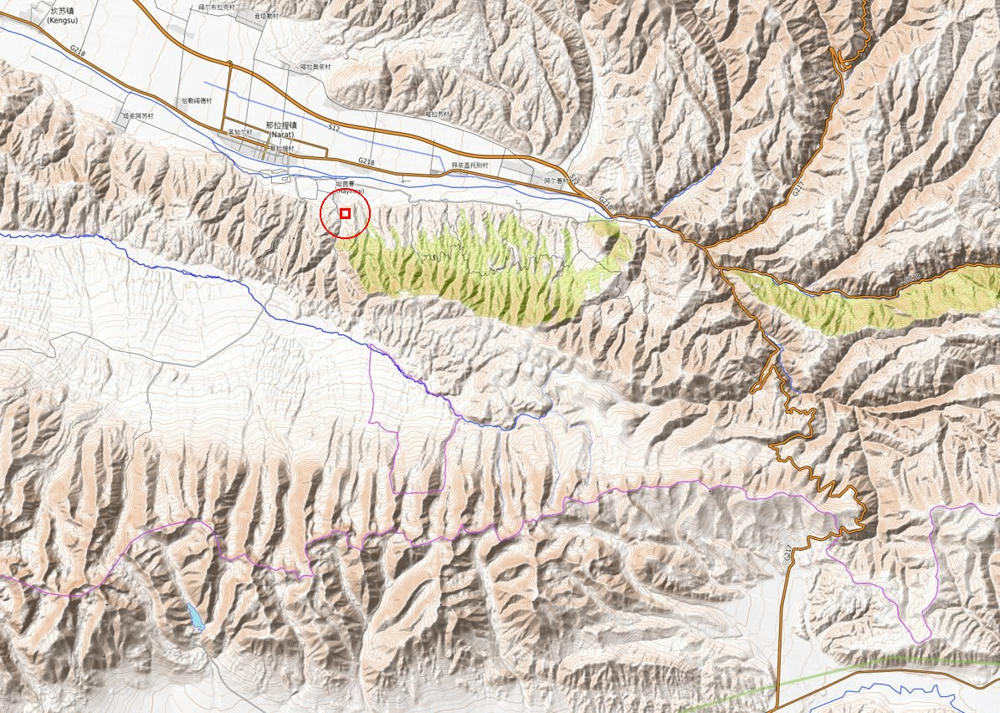

# Nalati — real geography, the 500 m problem, and the zone map

Round-2 design note (2026-09-22). The user has been to Nalati: *"You have the grasslands, you have the pine
forests, you have the sheep, the horses. And then you have the nearby sky grasslands, vast among vast, ending in
snow mountains. Find the google maps of nalati and make the zone map be like that."* — and then *"500 by 500 it's
hard for it to be vast grasslands."* This note is the real map, the ways to make 500 m feel vast, the
recommended in-shard layout, and 20 map mockups in `art/nalati-grasslands/round-2/6-maps/`.

## 1. The real place

`art/nalati-grasslands/round-2/6-maps/ref-opentopomap-nalati-slab-site.jpg` — OpenTopoMap tiles (z12, © OpenStreetMap
contributors, SRTM; CC-BY-SA) for 43.07–43.39° N, 83.85–84.46° E, about **50 km × 35 km**. North up. The red
square is where the recommended shard "sits", drawn **12× too big**: at this scale the real 500 m square is 1 pixel.

### Layout, north to south

A cross-section from Nalati town south to the snow ridge is four bands — and it is the same four bands the
recommended shard uses.

| band | where (real) | elevation | what is there |
|---|---|---|---|
| **Kunes valley floor** | Nalati town 43.327 N 84.001 E; the valley runs W–E, a "U" open to the west (the Ili valley) | 1,370 m at the town, ~1,500–1,600 m 20 km upstream | the **Kunes (Künes / Gongnaisi 巩乃斯) River**, braided, flowing **east → west** along the *south* side of the valley floor; G218 and the town on the north side; the scenic-area **visitor centre** on G218 2 km east of town (43.318 N 84.027 E); the "River Valley Grassland" (河谷草原) — yurts, horse racing ground, the Wusun (乌孙) burial relics |
| **The escarpment** | directly south of the river, 3–5 km deep | 1,500 → 1,900–2,000 m | a steep **north-facing** slope cut by dozens of parallel gullies; **Tian Shan spruce** (*Picea schrenkiana*, 40–50 m, narrow cones) fills the shaded gullies and north faces, grass on the spurs (the two green forest polygons in the reference); the Panlong road (盘龙古道) — 26 km, 600+ bends — winds up here |
| **Sky Grassland** (空中草原) | a smooth, treeless tableland, the big white area in the reference, >20 km W–E × 8–12 km N–S | 1,900–2,100 m at the rim, rising south to 2,200–2,400 m; "average ~2,200 m" in every guide | the famous part. Shuttle stops: 天界台 **Tianjie terrace** (the saddle that is "the watershed between the valley grassland and the sky grassland", the best view), 天牧台 **Tianmu terrace** (yurts, riding, archery, flowers), 游牧人家 **Nomad Home** ("at the foot of the Sky Grassland's south mountain", grass half a person deep, yurts and cooking smoke under the snow mountains) — the Sky Grassland route is 45 km round from the visitor centre; a brook crosses the plateau north-west |
| **Nalati range** | the crest 12–18 km south of the river | 3,000–3,600 m (SRTM max in the box ~3,600 m) | snow-capped peaks; Snow Lotus Valley (雪莲谷, a viewpoint at 43.165 N 83.926 E) at its north foot; beyond it the **Bayanbulak** basin (2,450 m) |

Also in frame: north of the valley the **Avral range** (阿吾拉勒山, 2,500–3,700 m here), bare/grassy with spruce
on its own north faces; to the east the **Duku Highway (G217)** comes down from the north, crosses the Kunes near
84.33 E (~27 km east of town) and switchbacks south over the Nalati range to Bayanbulak (its passes 2,730–3,450 m).

Numbers from SRTM 90 m samples (opentopodata.org): town 1,367 m; plateau 43.25 N 83.95 E 1,900 m; 43.26 N 84.10 E
2,290 m; 43.22 N 84.20 E 2,613 m; crest 43.13 N 83.98 E ~3,600 m. So **river → plateau rim is ~3–4 km and
~600 m of climb; river → snow crest ~15–18 km and ~2,000 m.**

Culture on the ground: Kazakh herders in white felt yurts, horses, sheep, cattle; transhumance — spring/autumn in
the valley, summer up on the high pasture (*jailau*); horse-riding and "girl-chasing" races (*kyz kuu*) at the
racecourse; the name is said to come from Genghis Khan's soldiers crossing a pass and crying *"Nalati!"* —
"where the sun comes out first". Kurgans (Wusun-period burial mounds) are part of the real valley route; Turkic
**balbals** (6th–8th c. stone warriors) stand in the same prefecture — the Xiaohongnahai stone man (Zhaosu
County), 2.3 m tall.

### Sources

- OpenStreetMap via Nominatim (scenic-area polygon 那拉提草原景区, visitor centre, Nalati town, 巩乃斯河 geometry, G218 /
  独库公路 nodes, 雪莲谷 viewpoint, Bayanbulak) — https://nominatim.openstreetmap.org · tiles https://opentopomap.org
- SRTM 90 m via https://api.opentopodata.org (two sample grids, 500 + 780 points)
- Wikipedia: [Künes River](https://en.wikipedia.org/wiki/K%C3%BCnes_River) (258 km, source 3,300 m, flows E→W to
  the Tekes/Ili), [China National Highway 217 / Duku Highway](https://en.wikipedia.org/wiki/Duku_Highway),
  [Picea schrenkiana](https://en.wikipedia.org/wiki/Picea_schrenkiana), [Kurgan stelae](https://en.wikipedia.org/wiki/Kurgan_stelae)
- Xinyuan County government, [那拉提旅游风景区介绍](https://www.xinyuan.gov.cn/xinyuan/xuny/202207/d8e1dbc4b9a146cbac8eadd26c9d8a96.shtml)
  (1,848 km², 1,600–2,800 m forest park, spruce, name legend)
- [China Discovery — Nalati Grassland](https://www.chinadiscovery.com/xinjiang/ili/nalati-grassland.html) (~2,200 m,
  zones, town 1.5 km from the gate), [Travel China Guide](https://www.travelchinaguide.com/attraction/xinjiang/ili/nalati-grassland.htm),
  [Sohu — three core routes](https://www.sohu.com/a/905062354_120111372) (stops, 45 km Sky Grassland route),
  [卯酉河 — 那拉提空中草原](https://www.maoyouhe.com/archives/51579) (Tianjie terrace is the valley/sky watershed saddle,
  Nomad Home grass half a person deep), Ctrip/Sina summaries via search (Panlong road 26 km, 600+ bends,
  1,800 → 2,717 m; "snow mountain – forest – grassland in one frame")
- [LoongWander — Steppe Stone Statues park, Zhaosu](https://www.loongwander.com/en-US/article/steppe-stone-statues-kazakh-culture-park)
  (Xiaohongnahai balbal)

The shuttle stops (Tianjie / Tianmu / Nomad Home) are not in OSM; their placement on the plateau is inferred from
the guides + the DEM + the scenic-area polygon, not surveyed.

## 2. The scale problem

Real Nalati, valley to snow crest, is ~17 km; the plateau alone is >20 km wide. A shard is a fixed 500 m × 500 m
slab (`CHUNK_SIZE`, `src/core/config.ts`; `docs/SHARDS.md`). On foot (4.3 m/s) the slab is a 2-minute walk; at the
horse's GALLOP (13 m/s, `docs/design/nalati/combat.md`) the long axis is **38 s**, a canter ~60 s. What exists to
fight it today: `src/world/Horizon.ts` draws three fogged ridge rings at 1.5 / 2.6 / 4.2 km (150 / 330 / 560 m
tall, one noise profile, same all the way round) over a cloud sea 240 m under the surface, all following the camera;
`src/world/Boundary.ts` draws the cyan edge lines, a 14 m glowing veil ribbon and the road gates.

### Options

| | idea | what it costs | verdict |
|---|---|---|---|
| **A. Painted horizon — the land goes on** | Nalati gets its *own* horizon: a near ring (0.7–1.4 km) of smooth green plateau hills rising out of the cloud sea to slab height, so from the Sky Grassland the grass visibly rolls on past the veil for kilometres; to the **south** the Nalati snow range, big (≈600 m tall at 4.2 km = the ~8° it really subtends from the plateau); to the **north** the valley drops away and the Avral range rises across it; **west** the valley opens flat toward the Ili (the widest, lowest horizon, the sunset side); **east** the valley narrows to a gorge with a hair-thin painted switchback (the Duku road) | engine-local: `Horizon.ts` gains an azimuth envelope + per-sector colour (a `horizon` field in `ChunkDef`, ~60 lines), still 3–4 draws, zero terrain cost | **yes** — the single biggest lever: "vast" is mostly what the eye sees past the edge |
| **B. Forced perspective + speed** | keep the plateau half **empty** (no trees, no rocks taller than a sheep, no props over 1 m except yurts), long unbroken sight lines; **scale the spruce down** to 12–20 m (real 40–50 m) so a 40 m escarpment reads as a forested mountainside; sheep flocks of 30–60 small bodies and a 12–20 horse herd seen *across* 300 m; heavier aerial perspective inside the slab (haze starts at 150 m, cool blue by 400 m) so the far side reads km away; cloud shadows sweeping across the grass; horse stamina tuned so a crossing is a canter (~60 s), not a gallop | tuning + one tree-scale param; no new systems | **yes**, together with A and D |
| **C. More or bigger chunks** | a 1–2 km Nalati chunk, or four adjacent shards (valley / escarpment / Sky Grassland / snow pass) streamed side by side | **changes a Wildshard fundamental**: `CHUNK_SIZE` is fixed for every shard (`src/core/config.ts`; `sources/wildshard/FUNDAMENTALS.md` says "chunk size is arbitrary but let's say 500 m × 500 m × 200 m"); chunks are dropped into the world grid by the server — "you don't choose where it gets popped in" — so four Nalati shards would not even be neighbours; `docs/SHARDS.md`: chunks are "not adjacent or streamed". Needs streaming, LOD terrain, cross-chunk AI, a 4–16× grass/terrain budget on the phone | **not now** — flag for the user; it is the only way to get real minutes of riding |
| **D. Stepped climb (vertical)** | the slab is a *cross-section of the climb*: valley floor at −10 m, a 40 m north-facing spruce escarpment, the Sky Grassland plateau on top at +30–38 m, snow crags +75 m in one corner — so from the plateau you look **down** over the river and **out** over everything, and from the valley the slope + snow fill the sky | terrain function only; stays inside SHARDS.md's "−10..+40 m" tip except the crag corner (off-road) | **yes** — it is how the real place works, and it makes the first minute a reveal |

**Recommendation: A + B + D, keep 500 m.** The slab is a 500 m slice of the real climb — riverbank, spruce
escarpment, the lip of the Sky Grassland, a snowy corner — and Nalati's own horizon ring continues the plateau
for kilometres and ends it in the snow range. The first minute is the real visitor's: arrive in the valley, cross
the bridge, climb the switchbacks through the spruce, top out on the rim and the Sky Grassland opens, running
past the slab edge into the painted plateau and the snow wall. C stays an open question for the user.

## 3. The recommended in-shard layout

Real compression: N–S ~17 km → 500 m (×34); W–E the plateau >20 km → 500 m (×40+); relief 600 m (river → rim)
→ 40 m (×15), so slopes are ~2× steeper than real — needed for the climb to read.

Engine coordinates: origin at the centre, **+z = north, −x = east** (`src/ui/Minimap.ts` convention), ±250 m;
y is metres relative to the entry roads (y = 0 at the gates). The roads are forced to y = 0 at the edges
(`buildTerrain`), so the E/W gates come in up ravines and the S gate through a saddle.

| POI | x | z | y (m) | compass | what's there |
|---|---|---|---|---|---|
| **N ROAD** (spawn) | 0 | +250 | 0 → −8 | N edge | the valley road from the visitor centre / G218; spawn at (0, +232) facing south, the whole climb in view |
| **KUNES RIVER** | enters −250, +178; exits +250, +150 | band z +140…+185 | water −10 | across the N | braided, 3–4 channels over grey gravel bars, flows **east → west** (toward +x) under the escarpment foot as in reality; fordable on the bars, deep pools on the outside bends |
| **BRIDGE** | 0 | +160 | deck −6 | N-centre | timber bridge on log cribs carrying the N road; a ford beside it on the gravel |
| **NOMAD CAMP** | +95 | +205 | −8 | NW valley | the spring camp (*kystau*): 6 yurts, corral, hitching rail, smoke; spawn hub, merchant, the tamed horse waits here |
| **SHEEP PASTURE** | −120 | +205 | −8 | NE valley | the valley meadow east of the road; flocks of 30–60 drift up onto the lower spurs by day |
| **SPRUCE FOREST** | gullies at x −170, −60, +135 | z +135…−15 | −6 → +28 | middle band | three spruce-filled gullies (dense, dark, 12–20 m trees) on the north-facing slope, grass spurs between; wolf den in the east gully |
| Sky road (switchbacks) | −20…+40 | +150 → −30 | −6 → +30 | centre | 4 hairpins up the central spur from the bridge to the rim — the Panlong road in miniature |
| **EAGLE ROCK** | +170 | −20 | tor top +50 | W rim | a 20 m granite tor on the rim = the Tianjie terrace view: the valley below, the plateau behind, the snow ahead |
| **W ROAD** | +250 | 0 | 0 → +28 | W edge | climbs the west ravine to the rim beside Eagle Rock |
| **E ROAD** | −250 | 0 | 0 → +28 | E edge | climbs the east ravine to the Kurgan Field |
| waterfall | +60 | −28 | +30 → +8 | rim | the plateau brook falls ~20 m into the west-centre gully and joins the Kunes |
| **SKY GRASSLAND** | 0 | −110 | +30 → +36 | S half | the open, treeless plateau z −30…−215; wind-combed grass, tall-grass stealth bands, flowers, cloud shadows; the horizon ring continues it past the veil |
| **HORSE PLAINS** | +140 | −120 | +32 | SW plateau | the wild herd (12–20), the stallion; longest clear ride on the shard: (+240, −60) → (−110, −205) ≈ 380 m |
| **KURGAN FIELD** | −120 | −85 | +31 | SE plateau | 7 grassy mounds 10–25 m across with stone kerbs; the great kurgan (dungeon, the Kurgan King) at (−140, −105) |
| **BALBAL CIRCLE** | +20 | −170 | knoll +40 | S-centre | a ring of 9 balbals, 24 m across, on a low knoll — the highest open point of the plateau |
| Summer yurts (optional) | +95 | −200 | +33 | SW plateau | 2–3 yurts, the *jailau* camp = the real "Nomad Home" stop at the foot of the south mountain |
| **THE CRAGS** | −190 | −195 | peak +75, snow > +55 | SE corner | a snowy granite massif, ledges and a cave for the snow leopard (irbis); source of the plateau brook |
| **S ROAD** | 0 | −250 | 0 → +18 | S edge | enters through a grassy saddle between the Crags and the SW spur, fords the brook |

Horizon ring for this layout (the A lever): S = Nalati snow range (the biggest, whitest, ~8°), SE/SW = the plateau
rolling on as low green hills at slab height, W = the valley opening flat to the Ili (sunset), N = valley drop +
the Avral range (brown-green, spruce streaks), E = the gorge and a thread of Duku switchbacks. Sun: late afternoon
from the **west-south-west**, so the snow range is side-lit from the plateau and the valley slope is lit from
the spawn — true north is kept (the map matches Google Maps) without back-lighting the peaks at spawn.

## 4. The mockups

All in `art/nalati-grasslands/round-2/6-maps/`, codex `gpt-6-sol`, painterly style B, refs = the round-1
top-down map + the style-B frame (+ the menu map tab for the HUD ones, + the OpenTopoMap crop for 05/06). Every
top-down one carries the 11 POIs + the four edge-midpoint roads.

**Best at showing the recommendation:** `map-01` (the layout, glass HUD), `map-11` (the horizon ring — the
"vast" answer), `map-12` (the stepped climb in section), `map-05` (where the shard sits in the real valley),
`map-20` (what it looks like on the phone).

| # | file | what it shows | layout | notes |
|---|---|---|---|---|
| 01 | `map-01-glass-hud-full-map.png` | in-game full map, glass HUD frame | **recommended** (A) | the cleanest read of the layout; brook + waterfall, S road through the saddle between two snow spurs |
| 02 | `map-02-parchment-explorer.png` | painted parchment explorer map, Kazakh ornament border, scale bar | A | river-flow arrow E→W; strongest "adventure map" look |
| 03 | `map-03-iso-diorama-slab.png` | isometric floating-slab diorama over the cloud sea, horizon beyond | A | shows the green plateau ring rolling on outside the slab; codex put the snow range to the *north* — the real one is south |
| 04 | `map-04-fog-of-war.png` | top-down with fog of war: valley + switchbacks + Eagle Rock revealed | A | the first-10-minutes map: the whole Sky Grassland is still cloud |
| 05 | `map-05-slab-in-real-valley.png` | **context map**: the real Nalati (town, G218, Kunes, Sky Grassland, Nalati range, Duku G217 switchbacks, → Bayanbulak) with the 500 m square as a tiny cyan box + zoom inset | real | follows the OpenTopoMap crop well; the square sits on the escarpment foot as in the ref |
| 06 | `map-06-three-zoom-levels.png` | zoom strip TIAN SHAN → NALATI · 5 KM → THE SHARD · 500 M | A | the middle panel is not true to 5 km; the right panel is a good portrait full-map |
| 07 | `map-07-layout-diagonal-climb.png` | alt layout: river across the NE corner, escarpment on the diagonal, plateau fills the SW half | diagonal | the biggest single open grass area of any layout; the crags moved SW |
| 08 | `map-08-layout-mirrored-sun.png` | alt layout mirrored (valley south, snow north) so the sun is behind the player at spawn | mirrored | reads fine but no longer matches Google Maps; a bit more faceted than style B |
| 09 | `map-09-layout-plateau-heavy.png` | alt layout "all sky": 75 % plateau, the river a thin strip far below the rim | plateau-heavy | the most "vast among vast" top-down; loses the valley camp (camp moved to the plateau, south) |
| 10 | `map-10-layout-river-valley-heavy.png` | alt layout "river valley grassland" (Hegu): the Kunes meanders through the middle | valley-heavy | Sky Grassland is only a strip along the south cliff; least faithful to the "sky grassland" memory |
| 11 | `map-11-horizon-ring-from-above.png` | **the vast-horizon solution from above**: slab over a cloud sea, the Sky Grassland rolling on for km as the ring, the Kunes valley opening west, the Nalati range | A | the reference image for the Horizon.ts work (option A); callouts HORIZON RING / CLOUD SEA / PAINTED 3–6 KM |
| 12 | `map-12-cross-section-diagram.png` | N–S cross-section: N road 0 → river −12 → spruce escarpment → plateau +35/+45 → crags +80 → S road 0; ring distances 1.5 / 2.6 / 4.2 km | A (vertical) | option D in one picture; has two bits of stray codex footer text (bottom corners) |
| 13 | `map-13-oblique-from-north-gate.png` | high oblique from behind the N gate looking south over the whole slab to the snow wall and the gas giant | A | the "arrival" composition; the river runs diagonal, E/W correctly mirrored for a south-facing view |
| 14 | `map-14-minimap-and-full-map-sheet.png` | UI sheet: round minimap (at the bridge/camp) + full map with 1×/2×/4×, POI/YOU legend | A | ready to hand to the HUD work |
| 15 | `map-15-scenic-signboard.png` | an in-world painted trail-map signboard at the camp, "YOU ARE HERE" | A | diegetic map / tutorial prop; nods to the real park's signboards |
| 16 | `map-16-dusk-threat-map.png` | the full map at dusk with threats: balbals + kurgans "WAKES AT DUSK", wolf zones, ghost-rider line on the rim, IRBIS on the crags | A | a night-mode map idea |
| 17 | `map-17-gameplay-zones-map.png` | design overlay: tall-grass stealth bands, GALLOP LAP 1.2 km · 90 s, "500 M · 40 S AT GALLOP", wolf den, leopard ledges, ford, herd arrows | A | the scale numbers on the map; plateau drawn smaller than in the table |
| 18 | `map-18-felt-syrmak-map.png` | the zone map as a Kazakh appliqué felt rug (syrmak) | A | a menu / loading-screen or in-yurt wall-map idea |
| 19 | `map-19-layout-waterfall-brook.png` | alt layout "two waters": a meandering plateau brook, the camp on the plateau inside a meander, a big waterfall into the spruce | brook | the summer-pasture (jailau) camp version — closest to the real "Nomad Home" stop |
| 20 | `map-20-phone-map-tab.png` | portrait phone MENU › MAP tab ("NALATI GRASSLANDS · SHARD 3"), exact copy of the Pine Hollow map tab chrome | A | how the full map ships |

Reference: `ref-opentopomap-nalati-slab-site.jpg` (real terrain, © OSM contributors / OpenTopoMap, CC-BY-SA).

## Open questions for the user

1. **Keep 500 m (A + B + D) or open the fundamental (C)?** A bigger Nalati chunk, or several adjacent ones, is
   the only way to get minutes of riding; it touches `CHUNK_SIZE`, the grid placement rule and streaming.
2. **True north (river north, snow south, as on Google Maps) or mirrored (`map-08`)?** Recommended: true north
   with a west-south-west afternoon sun.
3. **Where is the camp — valley (spring camp, `map-01`) or up on the Sky Grassland (summer *jailau*,
   `map-09` / `map-19`)?** Recommended: the main camp in the valley at the spawn, 2–3 summer yurts on the plateau.
4. **Spawn on the N road (the real arrival from G218 — cross the bridge, climb, reveal) instead of the S road
   the plan assumed?**
5. Which map presentation does the in-game full map use — glass HUD (`map-01` / `map-20`), parchment (`map-02`),
   or felt (`map-18`) as a loading screen?
