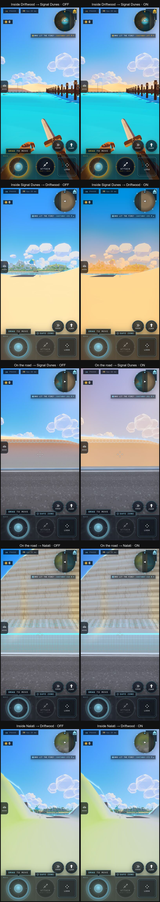
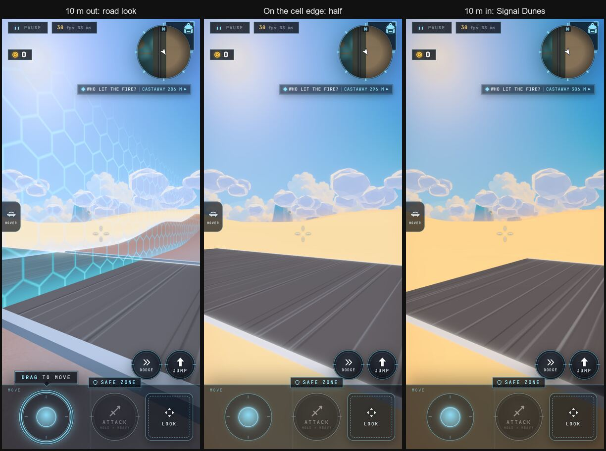

# SF19a: The Shard You Stand In Owns the Frame

**Status:** `unread` 2026-10-04: real-capture boards of G158 (the "Grid one frame" Debug row OFF vs ON): inside
Driftwood, inside Signal Dunes, on the road, from the road at Nalati, inside Nalati, and a three-step walk over Signal
Dunes' edge. Decides G122 (turn the row on in the grid and delete it?). Supersedes the SF19b boards.
**Link:** this page; the boards are in [art/grid/sf19a-frame-owner/](../../art/grid/sf19a-frame-owner/)
**Plan:** SHARD-PLATFORM (SF19a, G158; G122)
**Made by:** sf19a-proof (Opus builder for the shard-platform coordinator)

## What you are looking at

G158: inside a cell its shard owns the whole frame (its air, its grade, everything on screen including the neighbours);
on the road and the strips the neutral road look (G75's grey-blue grade, a desaturated home air); a 16 m blend centred on
the cell edge. Captured on build `2b61493` (Chromium as an iPhone 16 Pro, portrait, muted, Developer on, INFINITE
WILDSHARD entered from the title). Left column OFF, right column ON.

| Place (ON) | Frame owner | What changes against OFF |
| --- | --- | --- |
| Inside Driftwood → Signal Dunes | Driftwood (1.0) | Nothing in Driftwood itself: its own grade chain runs at full weight. The only change is Signal Dunes' warm dust band (G94) on the horizon, which draws only with the row on. |
| Inside Signal Dunes → Driftwood | Signal Dunes (1.0) | Signal Dunes' declared grade (−0.2 stops, 1.1 saturation, warm tint) and its dusk air apply to the whole frame: Driftwood on the horizon turns warm and hazy. |
| On the road → Signal Dunes | road (1.0) | The neutral road look: a fifth of the colour out and a cool tint (mean saturation 0.32 → 0.24); Signal Dunes' dust band reads as its mood from the road (G94). |
| On the road → Nalati | road (1.0) | The same road grade; this view is mostly Nalati's far-proxy skirt, so it changes little. |
| Inside Nalati → Driftwood | Nalati (1.0) | Nalati declares no grade, so only its air applies; its painterly hill draws the same OFF and ON (mean pixel difference 0.5 %): **G96 holds**, the painterly finish is kept. |

The crossing strip (row ON, looking north-west along the edge): 10 m out the road look owns the frame; on the line it is
half road, half Signal Dunes; 10 m in Signal Dunes owns it. The blend is a pure function of where the player stands, so
standing on the line holds a steady half-and-half (the readout gave 0.5 every frame of a 2.5 s hold): no flicker.

## Known limits

- **The sky and the sun stay the home cell's** inside a neighbour: inside Signal Dunes the sky is still Driftwood's blue,
  only the air, the haze and the grade are Signal Dunes'. A neighbour's own sky and sun need SF59 (per-shard post stacks
  and looks as data).
- **A home-built post chain can't fade on the road**: a home level that builds its own chain (a "replace" look) keeps its
  own grade on the road; only the air follows the owner there.
- **Signal Dunes and Nalati are far proxies** until M3 (closed soft walls, no colliders): the board holds the player
  frozen inside their cells to show the frame; nobody can walk in yet.
- **The SF19b boards** ([sf19b-one-frame](sf19b-one-frame.md), `d5c0670dd`) are **superseded**: they showed G75's
  per-pixel grading, which G158 replaced.

## Fixed while proving it

The frame's own grade never reached the screen: the code read a copy of the colour pass's effect list, so the road and
neighbour grades were computed but not drawn (only the home grade's fade was). Fixed in `2b61493f0`, with a test.

## Frame floor (grid, desktop + iOS Simulator)

Measured on `67f5c34a8` (contains the fix), in the coordinator's quiet window, `node scripts/frame-floor.mjs --shards=grid
--surface=both`, then the same with the row on (`--device-save=debug.global.gridOneFrame=on`):

| Row | Desktop (1440×900, 2×) | iOS Simulator (phone tier, 2×) | Result |
| --- | --- | --- | --- |
| OFF | 59.88 fps at spawn, beach, pier (p99 16.8 ms) | 30.30 fps at spawn, crossroads, wreck (p99 34 ms) | PASS |
| ON | 59.88 fps at spawn, pier, east deck (p99 16.8 ms) | 30.30 fps at spawn, crossroads, wreck (p99 34 ms) | PASS |

Both at the caps (desktop vsync, Simulator 30 fps): the row costs no measurable frame time. Results:
[OFF](../../progress/frame-floor/67f5c34a8-3878-1791151305711.json), [ON](../../progress/frame-floor/67f5c34a8-8897-1791151417897.json).
The Simulator runs on the Mac GPU, so this says nothing about the iPhone's GPU cost.

## Your call (G122)

Recommended: **turn the row on** in the grid and delete it, since the boards read as one game crossing between shard looks.
