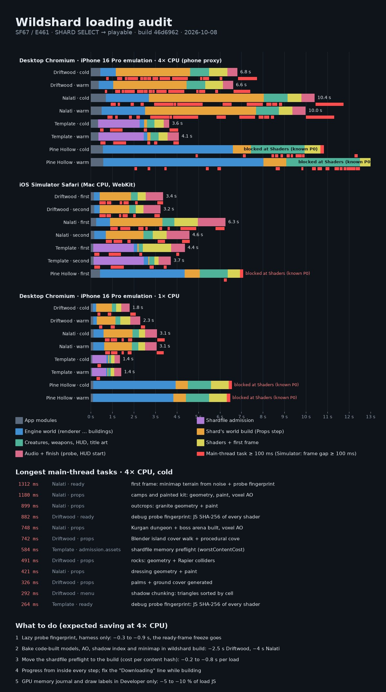

# SF67 loading audit (E461), 2026-10-08

Build `46d6962-muzq309n` (clean HEAD export, `scripts/serve-build.sh --head`). Flow measured: the bare title URL,
then SHARD SELECT, the shard's card and ENTER WORLD (the real `travel()`: `location.replace(?chunk=<slug>)`), until the
loading panel has faded. The template is a Developer-only card, so its runs have Developer on.

**Lanes.** (1) Desktop Chromium (Metal), iPhone 16 Pro emulation (402×874, 3×, phone tier), 4× CPU throttle as the phone
proxy, with a full Chrome trace and V8 sampling (`capture.mjs`, `analyze.mjs`; owners are source-mapped through the build's
hidden maps). (2) The same at 1× CPU. (3) The iOS Simulator's Safari (`sim.mjs`, Web Inspector over
`ios_webkit_debug_proxy`): steps, rAF gaps and an untimed ScriptProfiler aggregate. Through the proxy every WebKit
timestamp reads 0, so Safari samples cannot be tied to one freeze. Cold = fresh context (no SW, HTTP cache or IndexedDB),
warm = the same context again. The Simulator runs on the Mac's CPU and GPU: it is not phone evidence. Pine Hollow does
not load at HEAD in any lane: "Compressed texture 65 has no mipmaps and is not resident on this renderer" at the Shaders
step (`sim-pine-hollow-blocked.jpg`), the known compressed-texture P0 that sp-x4 owns. Pine's numbers stop there.

## Time to playable (ms)

| Shard | 4× cold | 4× warm | 1× cold | 1× warm | Simulator 1st | Simulator 2nd | Longest task, 4× cold |
|---|---:|---:|---:|---:|---:|---:|---:|
| Driftwood | 6 816 | 6 616 | 1 806 | 2 308 | 3 364 | 3 244 | 882 |
| Nalati | 10 401 | 9 989 | 3 074 | 3 059 | 6 260 | 4 590 | 1 312 |
| Template | 3 646 | 4 090 | 1 357 | 1 420 | 4 373 | 3 717 | 584 |
| Pine Hollow | blocked | blocked | blocked | blocked | blocked | — | 281 (no owner, see below) |

Warm is not faster: on every shard except the template's downloads, loading is CPU-bound. The cache saves bytes, not
time. Phase split for every run: `summary.json`. Driftwood at 4×: modules 0.45 s, engine world 0.72 s, **its own world
(Props) 3.45 s**, creatures/weapons/HUD 0.88 s, shaders + first frame 0.85 s, audio + finish 0.47 s.

## (a) The flow, per shard

Common to every shard:
1. **Tap ENTER WORLD**: `travel()` writes the handoff and `location.replace(?chunk=<slug>)` (src/game/travel/travel.ts:70). A fresh page: nothing survives but caches.
2. **index.html**: the shell panel paints from the first bytes, and the first-paint script fills in the name, tier and clock (index.html:104).
3. **src/entry.ts**: tier, then `three` in its own task, then `main`. `startSelected` loads the kit modules, calls `beginLoading` and the shardfile loader, and calls `installManifestShardfile` or `installShardfileProduct` (admission, see the template).
4. **session/data.ts**: prepares KTX2 and the audio catalogue, makes the boot plan, waits up to 2.5 s for the SW, streams the boot pack and prefetches. Menu art and *every* audio file are queued behind the pack. Viewmodel textures are drawn in a worker.
5. **core/bootstrap.ts** runs the engine steps: renderer, sky, terrain, cards, forest, then physics (the Rapier wasm compile was started first; the baked navmesh). Then world.ts runs edge (boundary, water, horizon), grass and cabins.
6. **Props** is the shard plugin's `world` hook (data.ts:47). Each shard builds its world here, on the main thread.
7. **animals** (creatures), **weapon** (loadout, HUD), **menu** (title art, the lazy UI).
8. **shaders**: `precompileLevel` already does this well. It links in parallel under KHR_parallel_shader_compile, polls in 12 ms slices and uploads textures in slices. Then **firstFrame**, and **audio** (the selected style decodes off-thread).
9. **finish.ts**: GPU recovery, then `installProbe` (a synchronous scene, HUD and shader fingerprint), `ws:ready`, the other shards' boot files into the SW, a 250 ms fade, and the first game frames (the Minimap paints here).

Per shard:
- **Driftwood**: no admission panel. Engine steps run with no tree factory. In **Props**, `DriftwoodHybrid.world` first admits Driftwood's shardfile in the page (`prepareHybridShard`: preflight, 237 ms), then `buildDriftwoodWorld` (world/build.ts:77) *generates* the island: ocean, pier, boat, boulders (rockKit, plus Rapier colliders), hut, lookout, wreck and shrine (lowpolyKit with **voxel AO ray-marched per model**), jetties, bushes, gulls, trailside, rope bridge, seabed, cove, palms and ground cover. Then `BlenderIsland.install` decodes the baked island (meshopt GLB), walks every cover triangle and **drops the triangles of the procedural cove it just built underneath** (BlenderIsland.ts:389–411). Then `releaseDriftwoodCopies` (G144 / G173). Shadow-chunk index sort, shaders, first frame, the probe.
- **Nalati**: analytic terrain and the terrain painter (noise); the sky clouds drawn from noise (the baked-texture fallback, skyBackdrop.ts:455); spruce cards and placement; grass field. **Props** = world/index.ts:78: nomad camps, outcrops (granite), dressing statics, the Kurgan dungeon and the Golden King's arena, all built and painted with voxel AO. Then the wildlife loft geometry, the arms and spear built in code, and **the first frame paints the whole minimap terrain layer from the analytic mask** (Minimap.ts:478 / 540, Nalati manifest.ts:104).
- **Template** (a shardfile product): descriptor fetch, parse and schema. Cache-read (IndexedDB, plus a preflight that includes `worstContentCost`). 167 immutable files fetched four at a time, each SHA-256'd. Validation (terrain tiles decoded, the budget computed again). Cache publication (durable writes and a presence check, about 0.7 s at 4×, warm too). Then the session with the shardfile client: terrain tiles decoded again, skins, wasm brains instantiated. Admission is **1.9–2.1 s of 3.6–4.1 s** at 4×.
- **Pine Hollow**: the engine path is heavy. Cabins (GLTF, KTX2 transcode in workers) take 3.5 s at 4×. Props, NPC rigs, crossbow and rifle, then Shaders, where `compressedUpload` refuses texture 65 (P0).

## (b) The longest main-thread tasks (4× CPU, cold; ms; owner = the first app frame of the V8 samples)

| # | ms | Shard · step | Owner (file:line) | Trigger |
|---|---:|---|---|---|
| 1 | 1312 | Nalati · first frame after Ready | Minimap `paintLayer` → `paintRegion` (src/engine/ui/Minimap.ts:478, :540) sampling Nalati's forest mask (src/shards/nalati-grasslands/manifest.ts:104 → world/terrain.ts:402–408, core/noise.ts:19), 57 %; probe fingerprint 22 % | first `Game.start` frame + finish.ts:121 |
| 2 | 1180 | Nalati · Props | world/index.ts:78 → NomadCamp.ts:43, painted.ts:250, paint.ts:82/179, engine/world/voxelAO.ts:62 | plugin world hook (runtime/state.ts:117) |
| 3 | 899 | Nalati · Props | outcrops.ts:44 → models/outcrop.ts:53 → world/granite.ts:11, engine/world/geometryKit.ts:140 | same |
| 4 | 882 | Driftwood · Ready | `programHash`, a JS SHA-256 over every linked shader's GLSL (src/engine/debug/probe.ts:171), from the eager `boot: fingerprint(...)` (probe.ts:364): scene traverse, `getComputedStyle` on every HUD node, `getShaderSource` per program | finish.ts:121 `installProbe`, every boot, production too |
| 5 | 748 | Nalati · Props | combat/goldenKing.ts:667 → world/KurganDungeon.ts:268/284 `buildStatic`, paint, voxelAO.ts:62 | same |
| 6 | 742 | Driftwood · Props | BlenderIsland.ts:225 `build` → islandInstances.ts:206 `coverTriangles`, BlenderIsland.ts:397 `dropTriangles`, engine/models/place.ts:1028, models/smallRock.ts:31 | world/build.ts:199 |
| 7 | 584 | Template · admission | product.ts:85 `admitProduct` → validate.ts:68 → budget.ts:34/57 `worstContentCost`, shardfile/terrain.ts:13, assets.ts:32 | entry.ts startSelected |
| 8 | 491 | Driftwood · Props | Boulders.ts:81 → rockKit.ts:119/232, Rapier `createCollider` (engine/physics/Physics.ts:43, wasm), models/colliders.ts:45 | build.ts |
| 9 | 421 | Nalati · Props | world/dressing/index.ts:132 → statics.ts:38, models/dressingProps.ts:105, geometryKit.ts:124/140, Physics.ts:43 | same |
| 10 | 326 | Driftwood · Props | Palms.ts:75 → models/palm.ts:45; GroundCover.ts:315/375; voxelAO | build.ts |
| 11 | 292 | Driftwood · menu/shaders | engine/world/shadowChunks.ts:74 `split`: island-wide meshes sorted into shadow cells (via precompile.ts `chunkShadowCasters`) | shaders step |
| 12 | 264 | Template · Ready | probe.ts:171 (as #4) | finish.ts:121 |
| 13 | 241 | Nalati · weapon | engine/player/nalatiArms.ts:287, runtime/weapons/Spear.ts:356 | loadout.ts:28 |
| 14 | 239 | Nalati · animals | engine/entities/species/loft.ts:123, models/animalGeometry.ts:5 | creatures/wildlife.ts:98 |
| 15 | 238 | Nalati · sky | engine/world/skyBackdrop.ts:455 via boot/bakedTextures.ts:64, core/noise.ts:19 (clouds drawn from noise) | sky step |

Also: Driftwood's in-page shardfile preflight, 237 ms (budget.ts:34). A 130 ms first physics step (Physics.ts:89, a catch-up
after loading). A 89–216 ms GPU-recovery snapshot when the previous page hides (GpuRecovery.ts:316) when that page had a
renderer. Pine's longest task is 281 ms (longtask observer), but its trace has no renderer-main events after the page started,
so its owners are unattributed. The Simulator's aggregate agrees (`summary.json` `simulatorProfile`): Driftwood's top
first-app frames are budget.ts:34 (6.5 %), probe.ts:171 (5.8 %) and gpuLabels.ts:184 (5.5 %). Nalati's are Physics.ts:43
`createCollider` (11.9 %), **allocationJournal.ts:41 (8.3 %)** and noise.ts:19. The template's is budget.ts:34 (25 %).

**The 10 s Driftwood freeze.** Not reproduced as one 10 s task in any lane. Frames do paint between tasks (rAF gaps equal the
long tasks). What was found is **Driftwood's Props step**. For 3.07 s at 4× (1.45 s in the Simulator), *nothing on the
loading screen changes*: the bar parks at 76 % and the line reads **"Downloading · 76%"** (Loading.ts:162 says
"Downloading" while `download < 1`, and audio/extras keep it at 99 % until the last step). Meanwhile the island is generated
in 100–740 ms tasks, and then the 882 ms probe freezes the Ready frame. The step reports no sub-progress: `slicer()` only
yields between builders (plan.ts:97), and the builders never call `p.set`. On a throttled, Low Power iPhone that same phase
is several times the Simulator's: a parked bar plus repeated half-second to one-second hitches, about 10 s, reads as a freeze.
The same shape is on Nalati: Props 5.3 s at 4×, the line stuck after 6.0 s, then a 1.3 s first frame.

## (c) Trade-offs and assumptions, and whether they still hold

| Trade-off (source) | Assumption | Still holds? | Do instead |
|---|---|---|---|
| **Models are code** (Driftwood / Nalati models/*.ts, lowpolyKit, rockKit; E306 / E315) | JS is far smaller than GLB; the CPU cost at launch is small | **No.** Download is small, but it costs 3.4 s (Driftwood) / 5.3 s (Nalati) at 4× on every launch, warm too, and transient arrays raise the load peak | `wildshard build` runs the deterministic builders in Node, emits meshopt GLB + collider bins; runtime decodes (wasm, fast) |
| **Voxel AO at load** (voxelAO.ts, "one baker", E357 X5) | — (named a baker, but runs on the phone) | No | Bake AO into vertex colour at build |
| **Procedural cove still built under the Blender island**, then its triangles dropped (BlenderIsland.ts header, E52 / E136) | The Blender asset might fail, so keep a fallback | No: the island is in the boot pack, and its failure already fails the boot | Build the procedural cove only if the island fails (or delete it) |
| **G144 / G173 GPU-only copies** (E450) | Memory, not download, binds | **Yes**, and it argues *for* baking: a rebuild can't reuse anything | Keep; bake so nothing needs regenerating |
| **Shardfile admission on every load** (SF8a `worstContentCost` d80f0ebca, SF46 hybrid 8ac19cb9b) | Re-validate content every load; a 113×113×4 grid of disc costs is cheap | No for first-party content with a known hash: 0.24 s (Driftwood) to 1.9 s (template) at 4×, warm too | Compute the cost in `wildshard build`, store it in the descriptor, verify by hash; cache the validation verdict per content hash + client version |
| **Durable cache publication on warm loads** (E458) | Re-publishing is harmless | No (0.7 s at 4×) | `414a98ad7` (not yet in HEAD) skips the rewrites; land it |
| **Driftwood hybrid**: shardfile admitted *and* the TS runtime builds | Transitional | Temporary | Ends with SF46-p; until then skip the in-page preflight for the first-party slug |
| **Debug probe fingerprint eager in production** (e7e28f349, E357 F2a: "boot is captured in the ready task") | The harness needs the boot fingerprint at Ready | Only the harness does | Compute it only when harness pins exist, or lazily on first read |
| **GPU allocation journal + draw labels always on** (renderer.ts:27, 81888d1c4 today; gpuLabels.ts:177) | Attribution must be complete | For Developer / harness only | Install only under Developer or the harness; the SF64 ledger reads from captures |
| **Shadow chunking at load** (E153, 0076cdb30) | Fine to sort once per launch | The goal holds (1.5 M → 0.26 M shadow tris); the sort doesn't need to run on the phone | Bake the cell-sorted index with the model, or keep it in IndexedDB keyed by geometry hash |
| **Minimap terrain from analytic noise in the first frame** | Painting once is cheap | No (0.75 s at 4× on Nalati) | Bake a minimap image per shard at build, or paint it in an OffscreenCanvas worker / time-sliced |
| **Every audio style and set downloaded at boot** (preload-offline 2026-09-23) | Offline-first, nothing fetched after the bar | Yes for download; decode is off-thread | Keep; only the selected set needs to block the bar |
| **KTX2 "not taken"** (load-perf 2026-09, ETC1S error, 0.5 MB transcoder: "buys GPU memory, not download") | Download is the constraint | **Reversed by G188**: memory binds; the phone loads KTX2 first; transcoding is in workers (fine) | Keep G188; fix the mips/resident P0 that blocks Pine |
| **Progress shows whole steps only**; "nothing eases or guesses" (Loading.ts header) | Steps are short | No: Props is 3–5 s at 4× | Builders report `p.set(i, n, label)` from the slicer; the line says "Building" once world bytes are in |
| **Shaders precompiled in parallel, textures uploaded in slices** (d584095, 3996b33, 5c6b8ef) | — | **Yes**, a good decision; not a top cost on desktop | Keep; phone-only Metal compile is unmeasured here |

## (d) Fixes, in order (savings at 4× CPU, measured task times)

1. **Probe fingerprint lazy / harness-only** (probe.ts:364, finish.ts:121): −0.26 s (template), −0.88 s (Driftwood), about −0.3 s (Nalati). Removes the Ready-frame freeze. S.
2. **Real progress during Props and an honest line**: builders report sub-progress through the slicer (plan.ts:97, Driftwood build.ts, Nalati world/index.ts); Loading.ts:162 says "Building the world" once the world's bytes are in (exclude extras and audio from that test). 0 ms, but it removes the "frozen at 76 % Downloading" look. S.
3. **Bake the code-built worlds** (Driftwood island models, voxel AO, rock / palm / bush geometry, colliders; Nalati camps, outcrops, dressing, Kurgan) into `wildshard build` output; build the procedural cove only on fallback: Driftwood Props 3.45 s → about 0.5 s (**−2.5 to −3 s**), Nalati 5.3 s → about 1 s (**−4 s**). No piece over 100 ms if the GLB parse is chunked per model. L.
4. **Shardfile cost + validation verdict at build, cached by hash** (budget.ts:57, validate.ts:33 / 68, product.ts:85), plus `414a98ad7`: template −1.0 to −1.4 s (−0.7 s more warm), Driftwood −0.24 s. M.
5. **Minimap layer baked or painted off-thread** (Minimap.ts:478): Nalati −0.75 s. S–M.
6. **GPU journal / labels behind Developer** (renderer.ts:27, gpuLabels.ts:177): about −5 to −10 % of load JS (Safari samples: 8.3 % on Nalati), every frame of play too. S.
7. **Shadow-chunk index baked** (shadowChunks.ts:74): −0.29 s on Driftwood. S.
8. **Nalati clouds baked** (skyBackdrop.ts:455 falls back to noise): −0.24 s. **Arms / creature geometry** baked or worker-built: −0.48 s. S each.
9. **Clamp the first physics step** after loading (Physics.ts:89): −0.13 s. S.
10. **Pine's compressed-texture P0** first: Pine has no time to playable at HEAD.

Expected at 4× after 1–5: Driftwood about 6.8 → 3.5 s, Nalati about 10.4 → 5 s, template about 3.6 → 2.2 s, with no task over
about 300 ms. Reaching "≤ 100 ms" also needs the GLB decode chunked per model.

## (e) Why the screen sat at 0 % with a blank name (template)

Before `6aadc5dfb` / `f4f9eb73e` (E458, both in this HEAD), `Loading` was constructed in session/data.ts **after** the whole
shardfile admission in entry.ts `startSelected`. For the template that is the descriptor, the IndexedDB read, 167 files
(5.85 MB) fetched and hashed, validation, `worstContentCost` twice and the durable cache publication: 0.7 s on desktop, 1.9 s at
4×, far longer on a phone over LTE. During that time index.html's static shell showed an empty `[data-el=slug]`, `00:00.0`
and both tracks at 0. Now the first-paint script names the shard from `?chunk` plus the title arrival and runs the clock,
and `beginLoading` comes before admission. This capture shows "Template shard" at 44 ms and every admission phase.
What is left: the setup bar counts admission as only 4 units, so it barely moves for 2 s; the 0.7 s cache phase moves
no bytes, so it looks stuck; warm loads redo it (`414a98ad7` pending).

## Files

- `capture.mjs`: Chromium lane (traces into a scratch dir). `analyze.mjs`: long-task ranking with source-mapped owners, plus `--sim` aggregation. `sim.mjs`: Simulator lane. `summarize.py`, `summary.json`: every run's phases, long tasks and owners. `infographic.py`, `infographic.jpg`. `sim-pine-hollow-blocked.jpg`.
- Raw traces (150–300 MB each) were not kept.
