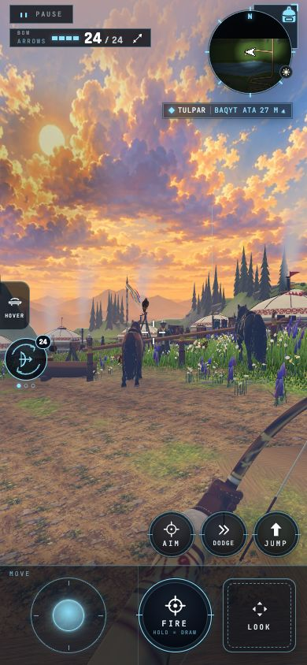

# E357 X3: authored boot inventories and chunk diagnostics

The independent asset work is built. Manual chunk groups remain **disabled** after two main-branch candidates failed four-shard boot checks. The strict checker stays available, and CI integration waits for a boot-proven layout after S4.4.

| Commit | Result |
| --- | --- |
| `46e4a5dd` | Manifest static closures, actual chunk module reports/checker, GPU references in unused-assets, boot helper contracts. |
| `b26e459a` | Disable groups after Rolldown emitted an undefined `main_exports` namespace; boot recovered. |
| `1364e49f` | Regenerate closure after boot tables; original Nalati Compare images and full owning audio inventory helpers. |
| `d2c7fecc` | Manifest-only Explore preload, owning other-shard audio prefetch, fallback removal, asset auditor in pnpm test. |
| `5b652c79` | B64 candidate with separate main facade: static checker green, all four boots failed `Ka is not a constructor`. |
| `613ea828` | Disable groups again; all four phone boots recovered. |

Clean-export generation, generation check, whole-tree tsc, ratchet, owned lint and Vite build passed before each source checkpoint. Ten focused asset/prefetch tests passed, including all four active profile download inventories before/after preparation. The auditor checks eight shard/tier inventories, declared images/audio, exact pack membership, GPU targets and required audio credits. [Audit output](x3-assets-audit.json).

The final cleanup removes the inactive legacy audio fallback and its last `def.ocean` branch from extras.ts. All four manifests already supply their existing `audio.preload` profiles; the exercised profile download/decode path is unchanged.

The generator intentionally leaves the closure untracked. `scripts/gen.mjs` and the direct Vite generator refresh it after generated boot tables add imports.

## Approved request-list changes (B56, B59)

Title-card requests retain their existing tier filtering. Original Compare pixels and review source paths remain identical. B56 replaces Driftwood's old cross-shard Explore glob with its owning list and includes nested Compare images.

| Shard | Explore URLs added | Explore URLs removed | Other-shard audio URLs added / removed |
| --- | ---: | ---: | ---: |
| Driftwood Isle | 6 | 24 | 16 / 0 |
| Pine Hollow | 10 | 0 | 21 / 6 |
| Nalati Grasslands | 11 | 0 | 98 / 0 |
| Nine Dragon Stack | 9 | 0 | 13 / 91 |

[Exact before/after URLs per shard](x3-asset-deltas.json), including authored image paths and Vite output URLs. These are expected offline-cache changes for milestone re-baselining. Only other-shard background prefetch resolves the owning audio hook; the active boot still uses its existing profile's download and decode lists.

## Narrow parent/final evidence

Parent `e02b1b271bcb3dab7a30b7a7a32a34d72e715f15`; recovery final `613ea828a1636482bb0e8196efd4281a0c2fe2ab`. Each ran `node scripts/parity.mjs --export=<sha> --lane=m5 --shards=all --tiers=phone --only=fingerprint+poses`.

All four final `boot.errors` arrays are empty. Every semantic boot field is identical to the parent, including complete audio objects (requests: Pine 109, Nalati 192, Driftwood 110, Nine 16), scene census, programs, GPU bytes, collider registry and HUD. Only build/SHA, elapsed timings and heap readings differ. Pose positions, calls, triangles and creature counts are identical at all twelve views. Eleven box inventories are exact; Nalati camp has a one-pixel box difference. The baseline verdict remains red from changes already present in the parent; this is a direct parent/final comparison. [Comparison](x3-parent-final.json).

Nalati camp inspected before / after:

## T3 and TP17

144 original `public/assets/tex/` files were audited against manifest image/KTX2 inventories. **54 files, 27.05 MiB**, are unreferenced review candidates; no assets were deleted. Their URLs, bytes, shard/tier references and GPU counterparts are in the [audit report](x3-assets-audit.json).

All per-shard and shared generated GPU table values now count as used. The [unused-assets report](x3-unused-assets.json) has zero GPU files in dev-only, unused or documented-only categories.

## Next

1. Finish S4.4, then prove any chunk layout on `refs/x3/...` before publishing it to main. With groups disabled, `check:chunks` deliberately remains red; no gate was relaxed. `refs/x3/recursive-engine` (`6dafbfa3`) passed static gates but failed all four runtime boots: dependency recursion pulls dynamic main startup into engine and starts world code early. The nonrecursive candidate also created an engine/Rapier cycle through the aliased bindings. Failed chunk tables are diagnostic, not accepted layout evidence.
2. Wire a boot-proven strict chunk checker into `scripts/vercel-tree-gate.sh` and the web deploy step.
3. Replace fixed boot steps and extract the E188 retry leaf with the composition-root owner, then implement/run `scripts/ios-retry-check.mjs` on the newest installed Simulator runtime.
4. Lead runs the offline proof: `node scripts/parity.mjs --export=613ea828a1636482bb0e8196efd4281a0c2fe2ab --lane=m5 --shards=all --tiers=phone --offline --out=/private/tmp/e357-x3-offline`.
