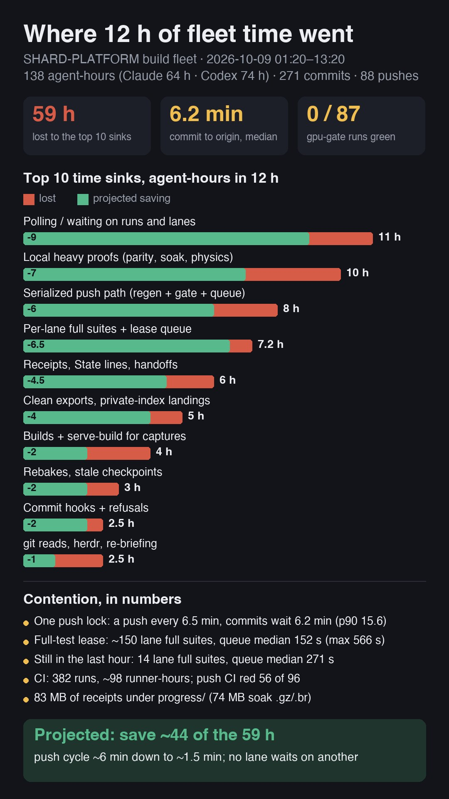

# SHARD-PLATFORM fleet audit: 2026-10-09, 01:20–13:20 (12 h)

Read-only audit for Jake: make the fleet (A) faster in wall-clock time and (B) do far less, with **contention, locking
and waiting first**. Sources: `git log` / `git reflog origin/main`, the gate scripts and hooks, `gh run list/view`
(382 runs), 29 Codex sessions (`~/.codex/sessions`, 74.7 agent-h, every tool call parsed), 72 Claude transcripts
(coordinator `6d7cc37d` + 68 subagents, 64 agent-h, every Bash call timed from tool_use to tool_result),
`~/.sim-lane/reap.log`, `~/.wildshard-heavy-lanes/queue.json`. Re-run with `python3 measure.py --hours N [--ci]`.
Claude Bash times are a floor: a call is capped at 600 s, so a polling loop that hit the cap counts as 600 s.

## 1. The numbers

| | 12 h | per hour |
|---|---|---|
| Fleet | **138 agent-h** (Claude 16 h main + 48 h in 68 subagents; Codex 74 h in 29 sessions) | ~11.5 agents live |
| Commits | **271**: 142 code · **51 SF6b regenerate** · **42 receipt-only** · **23 plan/doc-only** · 13 rebake | 22.6 |
| Commits that only satisfy a gate or record a receipt | **116 of 271 (43 %)** (regen + receipt + plan/doc) | 9.7 |
| `Plan-State: unchanged` trailers | **240** (in 89 % of commits) | 20 |
| `Generated-Increase` approval trailers | 196 in 35 commits (130 in the last hour alone) | |
| Pushes (origin/main updates) | **88**, one every **6.5 min** median | 7.3 |
| Commit → origin latency | **median 6.2 min, p90 15.6 min, max 31 min** (34 commit-hours in limbo) | |
| Push gate step times (Codex logs) | vitest 121 s · bake-check 111 s · `generated` 88 s · ratchet 66 s · oxlint 66 s · vite build 14 s · webkit 11 s; + regen 17–88 s; + heavy-lane `gate` queue median 115 s | |
| Pathspec commit (hooks) | median **32 s**, p75 57 s; 46 hook refusals (mostly the Plan-State check) | |
| Lane full suites | **~149** (82 Codex via heavy-lane, median 127 s, 3.0 h; 67 Claude) | 12 |
| Full-test lease queue | Codex 28 waits, median **152 s**, max 566 s, 1.5 h; Claude 19 waits, 0.4 h | |
| Lane test runs (any vitest) | Claude 647 runs, 5.6 h; Codex 554 vitest calls | ~100 |
| tsc / oxlint | Claude 218 / 134; Codex 272 / 640 calls | ~105 |
| Builds / serve-build | Claude 210 (2.7 h); Codex 194 serve-build | ~34 |
| Heavy proofs (Claude, timed) | parity 266 runs 2.4 h · physics-baseline 115 runs 1.9 h · soak 235 calls 1.8 h · boot-smoke 170 calls 1.2 h | |
| Heavy proofs (Codex calls) | parity 846 · soak 192 · boot-smoke 86 · physics-baseline 50 · sim-lane 82 | |
| Polling / waiting | Claude `until … sleep` loops **8.6 h** (366 calls, many at the 600 s cap); Codex explicit `sleep` 2.5 h (217 calls) + 1,313 `write_stdin` polls | |
| Clean exports and private-index landings | Claude: 108 `git archive` exports, 111 `link-node-modules`, 117 `generated-files --write`, 206 private-index ops; Codex: 294 private-index ops, 105 `generated-files` | |
| Plan file | `docs/plans/SHARD-PLATFORM.md` = **332 KB, 1,120 lines (~85 k tokens)**, rewritten in 18 commits (5.9 MB of blobs), 36 coordinator reads | |
| Handoff files | 103 versions of `progress/shard-platform/handoffs/*`; 287 Claude edits | |
| Evidence committed | **83 MB under progress/** (74 MB `progress/memory/sf57` soak `.gz`/`.br`, which do not delta), 11 MB `test/parity/baselines/`, 11 MB `art/`; generated docs churn: `lint/api-surface.json` 27× (20 MB), `docs/ENGINE.md` 41× (11 MB) | |
| CI | **382 runs, ~5,900 job-min (~98 runner-h)**. gpu-gate: **0 green** (43 failed at ~50 macOS job-min each, 44 cancelled). Push CI (`deploy`): 56 failed / 40 ok, ~33 job-min each (6 vitest shards; red on the Nalati sheep-rig URL test). script-conformance 88 × 5 min. boot-smoke 32 × 9.5 min | |
| Sim-lane reaper | **2,024** no-op "quit Simulator.app (nothing booted)" in 12 h; Simulator.app (pid 51352) has been up 14 days and never quits | 169 |

**After the coordinator's cuts (~12:15, 1.1 h of data, too short to judge):** 27 commits/h, 6 regen, 5 receipt-only;
push interval 8.2 min; commit → origin 5.8 min. **Codex lanes still ran 14 full suites with a median 271 s lease
queue in that hour**: the "no per-lane full suite" cut has not reached the Codex briefs yet. Re-measure tomorrow with
`measure.py --hours 12`.

## 2. Where the wall-clock goes (top 10, agent-hours in 12 h)

| # | Sink | Hours | Evidence |
|---|---|---|---|
| 1 | **Polling / waiting** on background soaks, floors, parity, sims and other lanes | **~11** | Claude 8.6 h of `until grep …; do sleep 15` (floor, capped); Codex 2.5 h of `sleep` |
| 2 | **Local heavy proofs** (parity, physics-baseline, soak, frame-floor, boot-smoke, Simulator) | **~10** | Claude 7.3 h timed; Codex ≥3 h (estimated from call counts) |
| 3 | **The serialized push path** (one `push.lock`: regen → gate → upload) | **~8** of lock time | 88 pushes × ~5–6 min; commits wait 6.2 min median; every lane that rebases on origin waits for it |
| 4 | **Per-lane full suites + the full-test lease queue** | **~7.2** | ~149 suites × 127 s = 5.3 h + 1.9 h queue. Cut ~1 h ago, but still happening in Codex lanes |
| 5 | **Receipts, State lines, handoffs, plan reads** | **~6** (est.) | 65 receipt/plan-only commits, 103 handoff versions, 18 rewrites of a 332 KB plan, 240 boilerplate trailers |
| 6 | **Clean exports + private-index landings** (each lane rebuilds the gate by hand) | **~5** | 108 exports of ~0.7 GB, 117 `generated-files --write`; per-lane `guards.sh`, `export-git.sh`, `cycle.sh`, `rebase.sh` |
| 7 | **Builds + serve-build for captures** | **~4** | Claude 2.7 h; Codex 194 serve-builds |
| 8 | **Rebakes and stale saved-game checkpoints** | **~3** | 13 rebake commits, 499 bake commands (1.5 h), "stale" in Codex output 832 times |
| 9 | **Commit hooks and refusals** | **~2.5** | 32 s per pathspec commit (two fresh exports: pre-commit guards + post-commit ratchet); 46 refusals → re-commits |
| 10 | **git reads, herdr chatter, re-briefing** | **~2.5** | Claude git reads 1.9 h; 290 herdr prompts; Codex re-read herdr `SKILL.md` 38×, `AGENTS.md` 12× |
| | **Total** | **~59 h of 138 (43 %)** | CI separately: ~98 runner-h, ~40 of them on a gpu-gate that holds nothing |

## 3. Ceremony and redundancy (what runs more than it needs to, and the rule behind it)

**Contention and waiting**
- **One push lock carries regeneration + a full gate + upload** (`scripts/push-main.sh` → `regenerate-committed.mjs`
  → `.githooks/pre-push` → `vercel-tree-gate.sh`; GIT.md SF6b). Pushes are back to back (6.5 min apart), so the lock is
  ~70 % busy and every commit waits ~6 min to reach origin. Lanes that need each other's work (checkpoints, rebases)
  wait on top of that.
- **The gate takes both heavy leases** (`full-test` + `build`, `heavy-lane.py` RESOURCES `gate`), so a lane's own full
  suite or build blocks the push (queue median 115 s), and the push blocks lanes.
- **Regeneration happens twice per push**: `regenerate-committed.mjs` builds a clean export and regenerates, then the
  gate's `generated` step (88 s) does a second clean export to check it. The outputs (`lint/api-surface.json` 770 KB,
  `docs/api/*`, ENGINE.md appendix, `layer-edges.json`, debt counts) are derived and could be built, not committed.
- **Approvals as receipts** (`GENERATED_APPROVAL_FILE`, GIT.md "Policy is source"): 35 approval commits, 196 trailers.
  The coordinator has dropped in-lane import-graph approvals; the receipt file remains for the rest.
- **Polling instead of notification**: lanes sit in `until …; do sleep` loops on soaks and other lanes' outputs.
- **Sim-lane reaper thrash** (`scripts/sim-lane.sh` `reap`, run by `browser-lane.sh reap` on every SessionStart / Stop /
  SubagentStop hook and lane wait): 2,024 `osascript quit` attempts in 12 h that never succeed.

**Duplicate checks**
- **The ratchet runs four times per change**: pre-commit guards (`precommit-guards.mjs`, its own export), post-commit
  (`.githooks/post-commit`, another export, advisory, and it cried "RATCHET ROSE" wrongly until 1c4600383), the push
  gate (66 s) and CI.
- **vitest runs three times**: the lane, the push gate (121 s, full), and push CI (6 shards, ~33 job-min).
- **script-conformance** runs in the push gate and again as its own CI workflow on every push (88 × 5 min).
- **Parity runs in lanes and in gpu-gate** on every push (7 macOS jobs). gpu-gate went 0 for 87 and holds no release
  (`.github/deploy-pin.json` mode `newest-ci-green`); it only spends ~2,400 macOS job-min per 12 h.
- **bake-check (111 s) runs on every push** even when no bake input changed; stale bakes then come back as rebake
  commits anyway.
- **Each lane re-implements the gate** in a private export (`git archive` → `link-node-modules` →
  `generated-files --write` → full vitest → `commit-tree`/`update-ref`); the coordinator's private-index landing recipe
  (GIT.md "Landing a worktree") made it the default.

**Records that protect nothing**
- **`Plan-State: unchanged`** (commit-msg → `scripts/asks.mjs commit-msg`, E423 decision 16): on 240 of 271 commits, and
  it caused most of the 46 refusals. It protects the plan's State line, which 18 commits rewrote anyway.
- **Per-lane Handoff files** (AGENTS.md "one live Handoff per lane, overwritten at every commit"): 103 versions in 12 h.
  The landing commit message already says the same thing.
- **A 332 KB plan as the coordination bus**: 36 coordinator reads (~85 k tokens each in full), 18 State rewrites, and
  3.1 B cache-read tokens fleet-wide in 12 h.
- **Raw soak / floor / parity data committed as receipts**: 74 MB of `.gz`/`.br` soak archives (no delta, `-delta`
  binaries) cross a 10–100 KB/s uplink under the push lock (E19), plus 42 receipt-only commits.
- **Heavy proofs per change**: physics-baseline 115 runs, boot-smoke 170 calls and soaks on every slice, though the
  AGENTS.md rule asks for physics-baseline only after collider changes.

## 4. The proposal, ranked by wall-clock saved (agent-h per 12 h)

Ranked with contention and waiting first. **Jake** = drops or changes a rule he made (needs his yes). **Coord** = an
SF6b / GIT.md mechanism the coordinator owns (Jake FYI). **Eng** = plain engineering.

| # | Change | Saves | Risk | Who |
|---|---|---|---|---|
| 1 | **Take regeneration off the push lock.** Stop committing derived outputs (api-surface, docs/api, ENGINE.md appendix, layer-edges, debt counts): build them in `pnpm gen`/CI, or one batched nightly commit. Delete the gate's duplicate `generated` step. | ~3 h lock time; 51 commits; 17–88 s + 88 s per push | Docs on GitHub lag a day; gate still checks the source | Coord |
| 2 | **Content-hash gate cache + affected-only tests at push.** Key each step by its inputs' tree hash (tsc / oxlint / ratchet on `src`+`lint`; bake-check only when bake inputs change; vitest `--changed <last gated SHA>` plus related). A full suite every Nth push and nightly; CI's 6-shard run is the backstop. | Push cycle ~6 → ~1.5 min; commit → origin ~6 → ~2 min; ~4 h | A transitive break lands and CI catches it minutes later; add auto-revert on red CI | Eng |
| 3 | **Give the push gate its own lease** (or priority 0) instead of `full-test`+`build`, and make lanes' quick checks lease-free. | 1.9 h of queue waits; the gate never waits on a lane | Two heavy jobs at once on the Mac: fine with lanes on quick checks | Eng |
| 4 | **No polling.** Long proofs run detached under one proof runner that writes a result file and pings the lane over herdr; lanes use `run_in_background`/Monitor and keep working. Ban `until … sleep` in the briefs. | ~9 h | None | Eng (SUBAGENTS brief) |
| 5 | **Lanes commit directly** with quick checks (pathspec commit, or a worktree plus one lander script); no per-candidate 0.7 GB export, no private index, no hand-written gate copies. Finish the Opus lane's push-time checkpoint re-record so no lane waits on another's checkpoints. | ~4 h + ~2 h stale-checkpoint waits | index.lock races (11 seen in 12 h); the lander serializes them | Eng / Coord |
| 6 | **Heavy proofs per milestone, not per slice**: soak, frame floor, boot-smoke, Simulator and WebKit at a milestone or when the change touches that system; physics-baseline only after collider changes (already the rule). | ~6–7 h | A perf regression is found at the milestone, not the commit | **Jake** (soak/floor cadence); Eng (physics) |
| 7 | **gpu-gate off the push trigger**: nightly plus dispatch at milestones; lanes stop local parity re-runs unless they touch rendering; re-record baselines once per milestone. | ~40 runner-h CI per 12 h; ~2–3 h local parity | Parity drift is found nightly. It is 0/87 green today, so nobody reads it now | **Jake** (GIT.md "per-push CI gate E357 Z4") |
| 8 | **Retire the plan as the coordination bus**: freeze SHARD-PLATFORM.md as the spec; a ≤3 KB STATE file written only by the coordinator once per landing batch; drop the commit-msg Plan-State check and the per-lane Handoff files (the landing commit message is the handoff). | ~4–5 h + ~85 k tokens per plan read | Plans drift unless the coordinator updates STATE per batch | **Jake** (E423 decision 16; AGENTS.md Handoff and State rules) |
| 9 | **Receipts out of git**: raw soak/floor/parity data goes to `~/.cache` or CI artifacts; the commit message carries the one-line verdict (≤2 KB summary at most). No receipt-only commits. | ~3 h + ≥63 MB push payload per 12 h | Old raw data is gone after the cache is reaped; keep verdicts | **Jake** (MACHINE.md "what you keep goes in the repo") |
| 10 | **Drop the approval receipts**: ratchet and graph rises warn at push and go into a weekly coordinator sweep; no `GENERATED_APPROVAL_FILE`. | ~1–2 h + lane stalls | Debt creeps between sweeps | Coord |
| 11 | **One export per commit for the hooks**, or drop the post-commit ratchet (it is checked again at the gate and in CI). | ~1 h (32 s → ~5 s per commit) | None | Eng |
| 12 | **CI dedupe**: `cancel-in-progress` for push CI on main (newest wins; today each SHA has its own group); drop the script-conformance workflow (the gate runs it); fix the red Nalati sheep-rig vitest so `newest-ci-green` releases again. | ~2,000 job-min per 12 h; releases unstick | None | Eng |
| 13 | **Fix the sim-lane reaper**: skip the `osascript quit` when nothing changed or the last quit failed. | ~0.5–1 h of hook latency | None | Eng |

Taken together: roughly **44 of the 59 h** come back (about a third of the fleet's 138 agent-hours). The push cycle
drops from ~6 to ~1.5 min, and no lane waits on another lane's checkpoint, test run or approval.

**One recommended answer for Jake:** say yes to 6, 7, 8 and 9 together (proofs per milestone, gpu-gate nightly, a
small coordinator-owned STATE with no Handoff files or Plan-State trailers, receipts out of git). The coordinator can
ship 1–5 and 10–13 without asking.

## Files

- `measure.py`: re-runs every number above for any window (before/after the cuts).
- `infographic.py` → `infographic.jpg`: the portrait summary (1080 × 1920).
