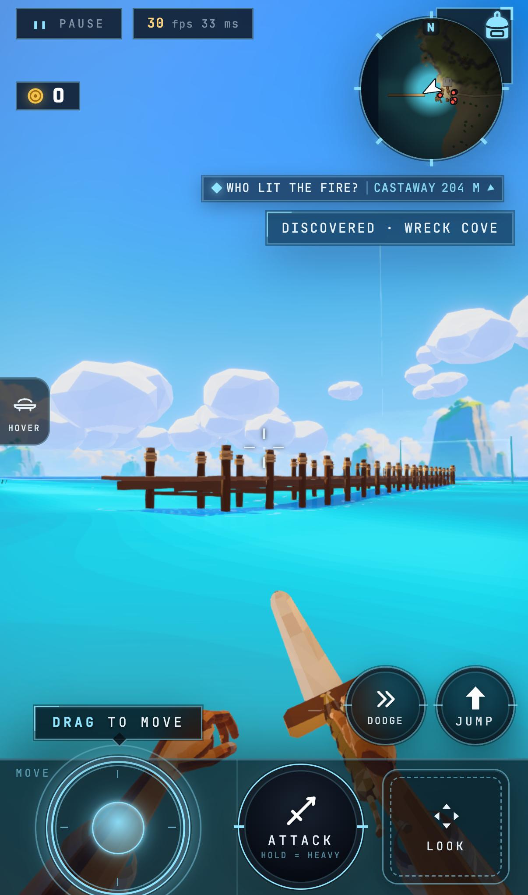
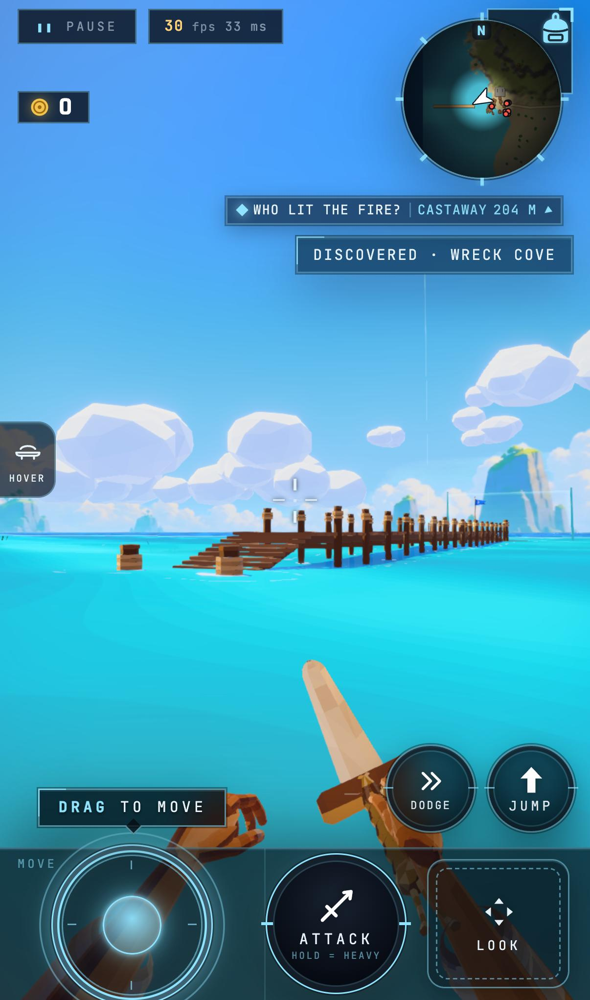

# G232 east jetty: real obstruction removed inside its authored extent

Before `65106ea87`, the east entry jetty ended flat at x178, about1.9m above adjacent ground. The actual walk controller stuck twice at x177.439, y-0.691; reverse walks were already clear. After `d8bfef811`, its existing pitched landing renderer/colliders slope onto the sand within the original72m extent. Two east and two west browser walks all finish with **0 stuck**, about17.8s east /17.6s west. There is no extension toward the wreck. The actual native motor/model fixture also traverses both directions. `ace9671ed` regenerates the changed navmesh and passes the targeted bake check.

The portraits are real iPhone16Pro402x874@3x Metal captures, viewed before committing. Standalone parent/candidate captures cover pier, beach and wreck on phone and desktop. All six visual SSIM scores are at least0.9941139; desktop minimum0.9999870. Both boots have zero errors and identical shader-program keys. **Strict fingerprint verdict remains RED for the intended geometry:** +1mesh/+1geometry/+7488 GPUbytes; the80-triangle landing draws in the main/shadow passes (pose draw delta0–2, triangles80–168). No fields are ignored to relabel that verdict. This is a traversal/visual proof, not a new frame-floor reading.

Reproduce with pinned `scripts/serve-build.sh --rev <sha>` from scratch, then `scripts/browser-lane.sh --max 10 node scripts/physics-baseline.mjs --url=<preview> --mode=walk --shard=driftwood-isle --route=progress/shard-platform/g232-east-jetty/route.json --repeat=2`. Capture `scripts/parity.mjs --only=fingerprint+poses` against the same two pinned previews, with identical midday/clear fixtures. All raw walk, pose/fingerprint and comparison assertions are preserved in assertions.json.gz; summary.json seals the decoded bytes. Browsers/previews closed.

Source `d8bfef811` and navmesh `ace9671ed` are on origin/main `c2623699a`. Ten focused ownership/probe/native fixtures, root strict, typed lint and targeted bake checks pass. The coordinator owns the frame-floor queue and plan state.
